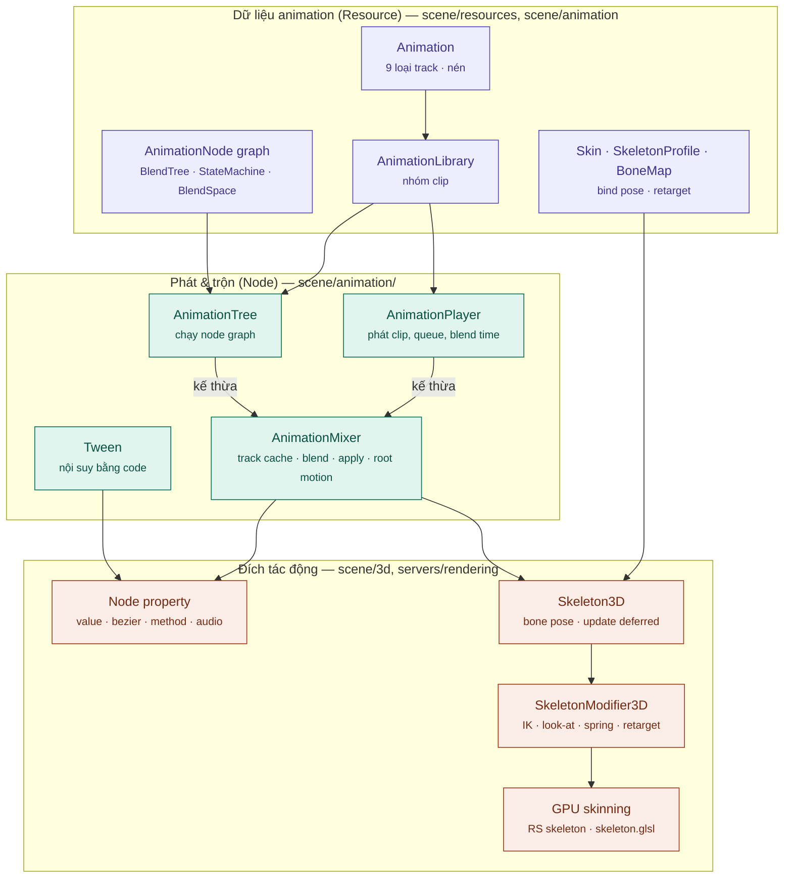
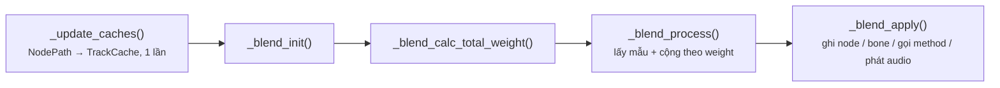
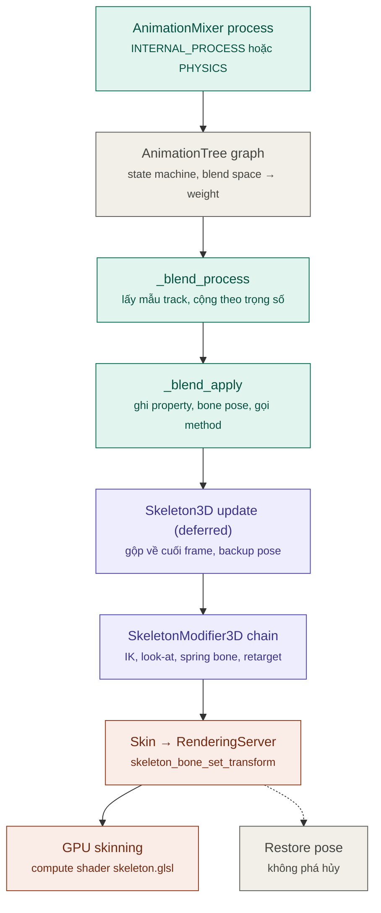
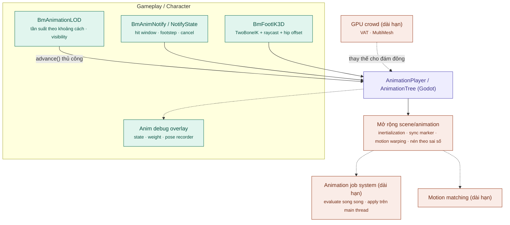

# Kiến trúc hệ thống Animation (Godot → Bamboo Engine)

> Phân tích dựa trên source code thực trong repo `bamboo` (Godot 4.8-dev): `scene/animation/`, `scene/resources/animation*`, `scene/3d/skeleton_*`, `scene/3d/*_modifier_3d.*`, `scene/2d/skeleton_2d.*`, `scene/resources/2d/skeleton/`, `editor/animation/`.
> Tài liệu liên quan: [architecture.md](architecture.md), [Render_Architecture.md](Render_Architecture.md), [Camera_Architecture.md](Camera_Architecture.md), [Guides.md](Guides.md).

---

## 1. Mô hình tổng quát

Animation trong Godot theo mô hình **"mọi thứ là track ghi vào property"**: một `Animation` là tập hợp track, mỗi track trỏ tới `NodePath:property` (hoặc `NodePath:bone`) kèm keyframe. Khi chạy, `AnimationMixer` lấy mẫu các track tại thời điểm hiện tại, trộn theo trọng số và ghi vào đích → animate được **bất kỳ property nào** (màu, UI, shader uniform, biến script…), không chỉ xương.

| Tầng | Vai trò | Thành phần chính |
| :--- | :--- | :--- |
| 1. **Dữ liệu** (Resource) | Lưu keyframe, graph trộn, thông tin xương | `Animation`, `AnimationLibrary`, `AnimationNode*`, `Skin`, `SkeletonProfile`, `BoneMap` |
| 2. **Phát & trộn** (Node) | Chọn clip nào chạy, trọng số bao nhiêu, rồi trộn | `AnimationPlayer`, `AnimationTree` → `AnimationMixer` |
| 3. **Đích tác động** | Nơi nhận kết quả | Property của node, `Skeleton3D` → `SkeletonModifier3D` → `Skin` → GPU skinning, blend shape |
| Nhánh riêng | Nội suy một lần bằng code | `Tween` (chạy bởi `SceneTree::process_tweens`) |

### 1.1 Sơ đồ kiến trúc

---

## 2. Chi tiết từng thành phần

### 2.1 `Animation` — dữ liệu (`scene/resources/animation.h`)

**9 loại track** (`TrackType`):

| Track | Dùng cho | Ghi chú |
| :--- | :--- | :--- |
| `TYPE_VALUE` | Bất kỳ property nào | Nội suy được nếu kiểu số |
| `TYPE_POSITION_3D` / `TYPE_ROTATION_3D` / `TYPE_SCALE_3D` | Transform node 3D hoặc bone | Nén được, đường đi nhanh nhất |
| `TYPE_BLEND_SHAPE` | Blend shape của mesh | Nén được |
| `TYPE_METHOD` | Gọi hàm tại thời điểm | Event: footstep, spawn VFX |
| `TYPE_BEZIER` | Đường cong Bezier tự do | Chỉnh trong Bezier editor |
| `TYPE_AUDIO` | Phát `AudioStream` | Giới hạn bằng `audio_max_polyphony` |
| `TYPE_ANIMATION` | Điều khiển một `AnimationPlayer` khác | Cutscene lồng nhau |

- **Interpolation**: `NEAREST`, `LINEAR`, `CUBIC`, `LINEAR_ANGLE`, `CUBIC_ANGLE`.
- **Update mode** (value track): `CONTINUOUS`, `DISCRETE`, `CAPTURE` (lấy giá trị hiện tại làm điểm đầu).
- **Loop**: `NONE`, `LINEAR`, `PINGPONG`.
- **Nén** (`struct Compression`, `animation.h:349`): track transform/blend shape được lượng tử hóa theo AABB và chia page; bật qua tùy chọn import "Compression".
- `AnimationLibrary` (`scene/resources/animation_library.h`) nhóm nhiều clip; mixer có thể gắn nhiều library (`"library/clip"`).

### 2.2 `AnimationMixer` — lõi trộn (`scene/animation/animation_mixer.cpp`)

`AnimationPlayer` và `AnimationTree` **đều kế thừa** `AnimationMixer`; chúng chỉ khác ở cách quyết định *clip nào chạy với trọng số bao nhiêu*. Phần trộn và ghi kết quả dùng chung.

`_process_animation()` (dòng 1026):

- **`_update_caches()`** (dòng 662): ánh xạ track → `TrackCacheTransform` / `TrackCacheBlendShape` / `TrackCacheValue` / `TrackCacheMethod` / `TrackCacheAudio` / `TrackCacheAnimation` (resolve `NodePath` → object pointer / bone index một lần rồi tái dùng).
- **`_blend_process()`** (dòng 1234): với mỗi `AnimationInstance` (clip, time, delta, weight) lấy mẫu track và cộng dồn; rotation dùng quaternion; value không nội suy được thì chọn theo `callback_mode_discrete` (`DOMINANT` / `RECESSIVE` / `FORCE_CONTINUOUS`).
- **`_blend_apply()`** (dòng 1913): ghi transform vào node/bone, value vào property; method gọi ngay hoặc deferred (`callback_mode_method`: `DEFERRED` / `IMMEDIATE`); audio phát qua player nội bộ.

Tính năng phụ:
- **Root motion** (`root_motion_track`): tách chuyển động xương gốc thành vector để code di chuyển `CharacterBody3D`; `RootMotionView` vẽ debug.
- **RESET animation** (`apply_reset`): pose mặc định, làm chuẩn khi trộn và khi lưu scene.
- **`callback_mode_process`**: `IDLE`, `PHYSICS`, `MANUAL` (tự gọi `advance()`).
- **Deterministic mode**, `post_process_key_value` (hook chỉnh giá trị trước khi ghi).

### 2.3 `AnimationTree` — graph trộn (`scene/animation/animation_tree.h`)

Graph gồm các `AnimationNode` (Resource); mỗi node có `_process()` trả `NodeTimeInfo`, gọi `blend_input()` / `blend_node()` / `blend_animation()` để đẩy clip + trọng số xuống mixer.

| Node | Chức năng |
| :--- | :--- |
| `AnimationNodeAnimation` | Lá: phát một clip |
| `AnimationNodeBlendTree` | Graph tự do |
| `AnimationNodeStateMachine` (+ `Transition`, `Playback`) | FSM, transition có điều kiện/expression, xfade, `travel()` tìm đường giữa state |
| `AnimationNodeBlendSpace1D` / `2D` | Trộn theo tham số (tốc độ, hướng); 2D dùng tam giác hóa |
| `Blend2/3`, `Add2/3`, `Sub2` | Trộn và additive |
| `OneShot` | Chèn hành động lên trên, fade in/out |
| `Transition` | Chuyển giữa nhiều input có xfade |
| `TimeScale` / `TimeSeek` | Đổi tốc độ / nhảy thời gian |
| `AnimationNodeExtension` | Viết node mới bằng script / GDExtension |

- **Filter**: lọc track (vd. chỉ thân trên) → layered blending.
- **Sync**: node con chạy đồng bộ thời gian để chân không trượt khi trộn.
- **Tham số** expose dạng `parameters/...` (vd. `parameters/locomotion/blend_position`).

### 2.4 Skeleton & modifier (`scene/3d/skeleton_3d.cpp`)

- `Skeleton3D` giữ bone (rest, pose, global pose). Pose đổi → `_make_dirty()` → **gộp cập nhật về cuối frame** (`_update_deferred` → `NOTIFICATION_UPDATE_SKELETON`, dòng 352) → nhiều nguồn ghi nhưng mỗi frame chỉ tính một lần.
- `modifier_callback_mode_process`: `IDLE` / `PHYSICS`.

**`SkeletonModifier3D`** — node con của skeleton, chạy theo thứ tự trong cây **sau khi animation đã ghi pose**:

| Nhóm | Modifier (file trong `scene/3d/`) |
| :--- | :--- |
| IK | `TwoBoneIK3D`, `CCDIK3D`, `FABRIK3D`, `JacobianIK3D`, `SplineIK3D`, `ChainIK3D`, `IterateIK3D` (+ `SkeletonIK3D` cũ) |
| Ràng buộc | `LookAtModifier3D`, `AimModifier3D`, `CopyTransformModifier3D`, `ConvertTransformModifier3D`, `BoneConstraint3D`, `LimitAngularVelocityModifier3D` |
| Vật lý thứ cấp | `SpringBoneSimulator3D` + `SpringBoneCollision{Sphere,Capsule,Plane}3D` |
| Retarget / chỉnh xương | `RetargetModifier3D`, `BoneTwistDisperser3D`, `BoneSpaceAdjuster3D` |
| Ragdoll | `PhysicalBoneSimulator3D` (`scene/3d/physics/`) |

Mỗi modifier có `influence` (0–1); viết modifier bằng script qua `_process_modification_with_delta(delta)`.

**Modifier không phá hủy (non-destructive)**: trước khi chạy modifier, skeleton backup pose gốc (`bones_backup`); sau khi đẩy lên skin thì **khôi phục** (`skeleton_3d.cpp:365-455`). Frame sau animation trộn trên pose sạch → IK không cộng dồn lỗi qua các frame.

**Skinning**: với mỗi `SkinReference`, gọi `RS::skeleton_bone_set_transform(skeleton, i, global_pose * bind_pose)`; renderer RD biến đổi đỉnh trên GPU bằng compute shader `servers/rendering/renderer_rd/shaders/skeleton.glsl`.

**2D**: `Skeleton2D` + `Bone2D` + `SkeletonModificationStack2D` (`scene/resources/2d/skeleton/`: CCDIK, FABRIK, TwoBoneIK, LookAt, Jiggle, PhysicalBones); `AnimatedSprite2D` + `SpriteFrames` cho sprite theo frame.

### 2.5 Retargeting

- `SkeletonProfile` (vd. `SkeletonProfileHumanoid`) = bộ xương chuẩn; `BoneMap` ánh xạ tên xương model → profile.
- Post-import plugin (`editor/import/3d/`): `post_import_plugin_skeleton_renamer`, `_rest_fixer`, `_track_organizer` — đổi tên xương, chuẩn hóa rest pose, sắp track lúc import.
- Kết quả: một bộ animation humanoid dùng chung cho nhiều model. Runtime: `RetargetModifier3D` chép pose giữa skeleton khác tỉ lệ.

### 2.6 `Tween` (`scene/animation/tween.h`)

- Tạo bằng code (`create_tween()`); tweener: `PropertyTweener`, `MethodTweener`, `CallbackTweener`, `IntervalTweener`, `SubtweenTweener`, `AwaitTweener`.
- Easing: `TRANS_LINEAR/SINE/QUAD/CUBIC/QUART/QUINT/EXPO/CIRC/ELASTIC/BOUNCE/BACK/SPRING` × `EASE_IN/OUT/IN_OUT/OUT_IN`.
- `SceneTree::process_tweens()` (`scene/main/scene_tree.cpp:825`) chạy trong physics và idle; không đi qua `AnimationMixer`.

### 2.7 Công cụ editor (`editor/animation/`)

Track editor + Bezier editor, Animation library editor, AnimationTree editor (BlendTree, StateMachine, BlendSpace 1D/2D), onion skinning, RESET track tự động, import animation từ glTF/FBX (`modules/gltf`, `modules/fbx`).

---

## 3. Luồng xử lý một frame (nhân vật 3D)

- Bước B chỉ có với `AnimationTree`; với `AnimationPlayer`, danh sách instance + trọng số đến trực tiếp từ clip đang phát và blend time.
- `Skeleton3D` hỗ trợ **scene thread group** (`notify_deferred_thread_group`) — nếu đặt các nhân vật vào process thread group khác nhau, cập nhật skeleton có thể chạy song song. Mặc định vẫn chạy trên main thread.

---

## 4. Những điểm còn thiếu của hệ thống hiện tại

| # | Vấn đề | Hệ quả cho game |
| :--- | :--- | :--- |
| 1 | Mỗi `AnimationMixer` chạy độc lập trên main thread; song song phải tự cấu hình thread group | Cảnh đông nhân vật (crowd, RTS, horde) nghẽn CPU |
| 2 | Không có **animation LOD** (giảm tần suất theo khoảng cách/visibility, dừng khi ngoài màn hình) | Tốn CPU cho nhân vật xa hoặc bị che |
| 3 | Không có **GPU crowd animation** (vertex animation texture, instanced skinning) | Không làm được hàng nghìn nhân vật chuyển động |
| 4 | Chỉ crossfade tuyến tính; không có **inertialization**, không có **motion matching** | Chuyển động thiếu tự nhiên, state machine phức tạp |
| 5 | Sync chỉ theo tỉ lệ thời gian; không có **sync marker** (pha bước chân) hay **notify state** (hit window, cancel window) | Trượt chân khi trộn clip khác nhịp; combat tự code khung thời gian |
| 6 | Root motion chỉ một track; không có **motion warping** hay preset **foot IK** bám địa hình | Nhân vật trượt, chân lơ lửng trên dốc |
| 7 | Nén chỉ lượng tử hóa cố định, không nén theo sai số (kiểu ACL) | Bộ nhớ animation lớn trên mobile |
| 8 | Không có công cụ debug pose khi chạy game (state machine, ghi pose) | Khó điều tra lỗi animation trong build |
| 9 | Không có hệ facial / lip-sync; không có cơ chế đồng bộ trạng thái animation qua mạng | Mỗi game tự làm |

---

## 5. Đề xuất nâng cấp cho Bamboo

Các đề xuất dưới đây là **định hướng kỹ thuật**, chưa phải tính năng có sẵn. Tên lớp `Bm*` là tên tạm.

### 5.1 Kiến trúc đề xuất

### 5.2 Ngắn hạn — module, không sửa lõi

1. **`BmAnimationLOD`**: quản lý tần suất cập nhật mỗi nhân vật theo khoảng cách camera và visibility (`VisibleOnScreenNotifier3D`).
   - Chuyển `callback_mode_process = MANUAL`, tự gọi `advance(delta_tích_lũy)` mỗi N frame.
   - Tắt `SkeletonModifier3D` (IK, spring bone) khi ở xa.
   - Mục tiêu: giảm 50–80% chi phí animation trong cảnh đông.
2. **Tự động phân nhóm thread**: tool/node gán nhân vật vào các process thread group để `AnimationMixer` + `Skeleton3D` chạy song song, tận dụng `notify_deferred_thread_group` có sẵn.
3. **Hệ notify mở rộng**: `BmAnimNotify` (sự kiện tức thời) và `BmAnimNotifyState` (cửa sổ begin/tick/end), xây trên method track + editor plugin — dùng cho hit window, footstep, cancel window, VFX.
4. **Preset foot IK & look-at**: `BmFootIK3D` (`TwoBoneIK3D` + raycast mặt đất + điều chỉnh hông); `LookAtModifier3D` cấu hình sẵn giới hạn góc cho đầu/mắt.
5. **Debug overlay**: vẽ state hiện tại của `AnimationNodeStateMachinePlayback`, trọng số input, root motion vector; ghi pose N giây gần nhất để replay.

### 5.3 Trung hạn — mở rộng `scene/animation`

6. **Inertialization blending**: `AnimationNodeExtension` hoặc patch `AnimationNodeTransition` / `StateMachine` thêm chế độ xfade inertialization (lưu offset + vận tốc bone, suy giảm theo đa thức) — mượt hơn và rẻ hơn crossfade vì chỉ đánh giá một pose.
7. **Sync marker**: thêm marker (foot_left, foot_right…) vào `Animation`; `AnimationNodeSync` căn theo pha marker thay vì tỉ lệ thời gian.
8. **Motion warping**: modifier điều chỉnh root motion trong cửa sổ notify để nhân vật tới đúng vị trí/hướng mục tiêu (leo, vault, finisher).
9. **Nén theo sai số**: chế độ import nén theo ngưỡng sai số vị trí đầu xương (curve fitting + lược key), giữ lượng tử hóa hiện có làm bước sau.

### 5.4 Dài hạn — thay đổi kiến trúc

10. **Animation job system**: tách *evaluate* (lấy mẫu + trộn pose, dữ liệu thuần không Variant) khỏi *apply* (ghi vào node). Evaluate cho mọi nhân vật chạy song song trên `WorkerThreadPool`; apply trên main thread. Cần pose buffer riêng cho track transform — đường đi nhanh song song với `TrackCacheTransform`.
11. **GPU crowd**: bake animation thành vertex animation texture (VAT) hoặc bone texture, render bằng `MultiMeshInstance3D` + shader đọc texture — cho hàng nghìn unit.
12. **Motion matching**: module tìm pose phù hợp nhất trong database clip theo trajectory + pose feature, kết hợp inertialization (#6).
13. **Mạng & facial**: đồng bộ **tham số** `AnimationTree` (không đồng bộ pose) cho multiplayer; pipeline lip-sync từ audio → viseme blend shape.

### 5.5 Thứ tự ưu tiên khuyến nghị

| Thứ tự | Hạng mục | Lý do |
| :--- | :--- | :--- |
| 1 | `BmAnimationLOD` (#1) | Lợi ích hiệu năng lớn nhất, không sửa lõi |
| 2 | Notify / NotifyState (#3) | Chuẩn hóa combat & sự kiện cho mọi game |
| 3 | Foot IK & look-at preset (#4) | Chất lượng di chuyển 3D thấy rõ |
| 4 | Debug overlay (#5) | Tăng tốc tuning animation |
| 5 | Inertialization (#6) | Nâng cấp chất lượng chuyển động rõ nhất, chi phí vừa |
| 6+ | #7–#13 | Theo thể loại: crowd/RTS ưu tiên #10–#11; action/AAA ưu tiên #7, #8, #12 |

### 5.6 Nguyên tắc khi sửa animation trong fork Bamboo

- **Không đổi định dạng `Animation` resource theo cách phá vỡ tương thích** — file `.tres/.res/.glb` hiện có phải load được; thêm dữ liệu mới (marker, notify) dưới dạng trường tùy chọn.
- **Không đổi API công khai của `AnimationPlayer` / `AnimationTree` / `AnimationMixer`**; tính năng mới qua `AnimationNodeExtension`, `SkeletonModifier3D` mới hoặc node `Bm*`.
- Giữ nguyên tắc **modifier không phá hủy** của `Skeleton3D`.
- Patch trong `scene/animation/` hoặc `scene/3d/skeleton_*` đánh dấu `// BAMBOO:`, gom commit riêng theo tính năng.
- Mọi tính năng mới phải chạy đúng với `callback_mode_process` = `IDLE`, `PHYSICS` và `MANUAL`, và với physics interpolation bật/tắt.
