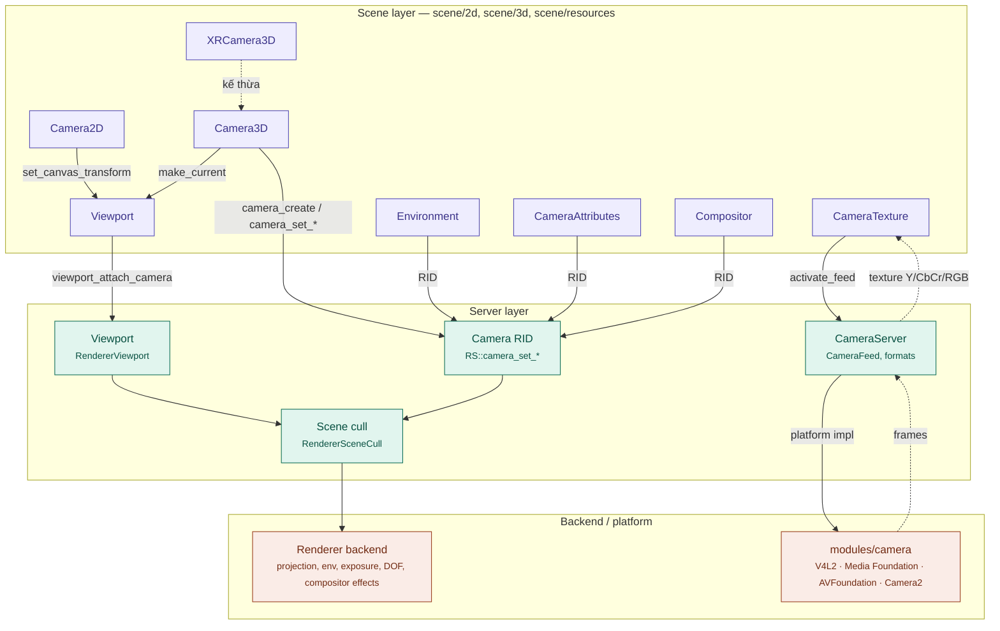
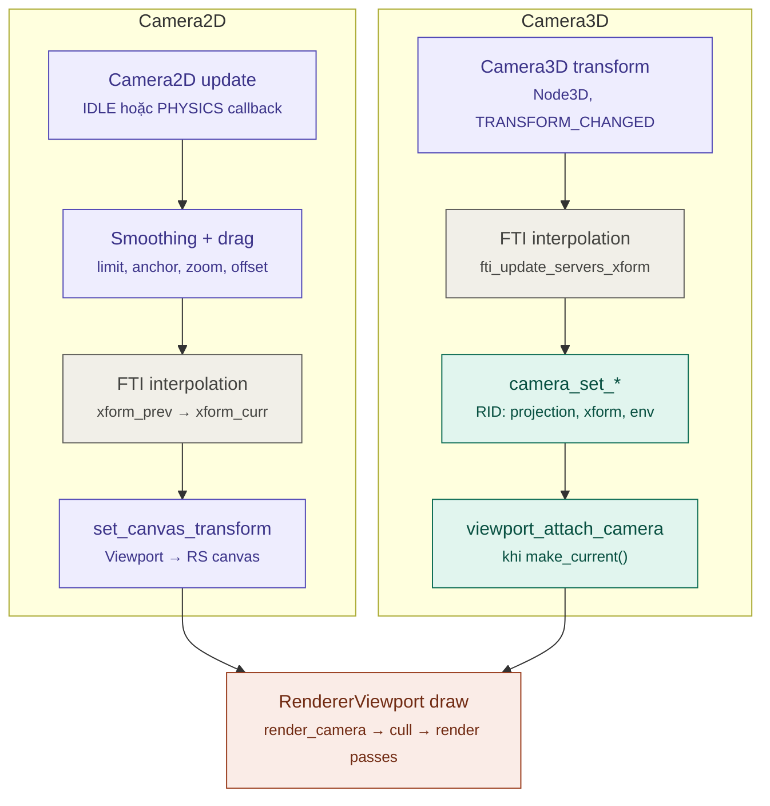
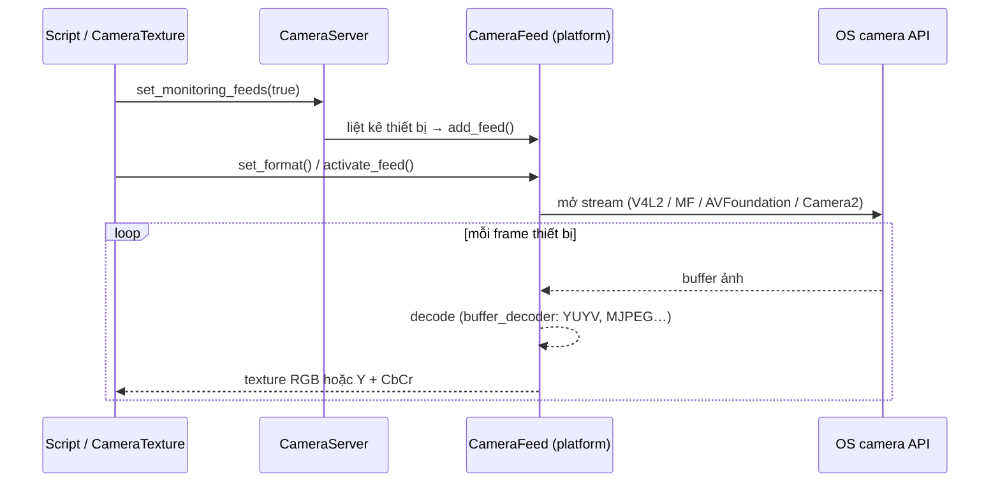
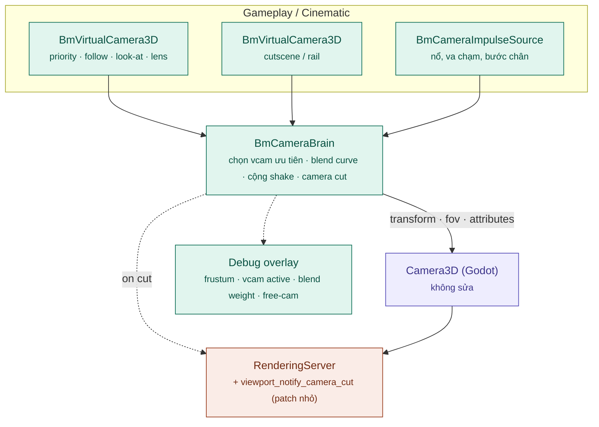

# Kiến trúc hệ thống Camera (Godot → Bamboo Engine)

> Phân tích dựa trên source code thực trong repo `bamboo` (Godot 4.8-dev).
> Tài liệu liên quan: [architecture.md](architecture.md), [Render_Architecture.md](Render_Architecture.md), [ENGINE_ANALYSIS.md](ENGINE_ANALYSIS.md).

---

## 1. Mô hình tổng quát

"Camera" trong Godot thực chất là **hai hệ thống độc lập** dùng chung tên:

| | Camera ảo (render view) | Camera vật lý (device camera) |
| :--- | :--- | :--- |
| Mục đích | Quyết định nhìn thế giới game từ đâu | Lấy hình từ webcam / camera điện thoại / AR |
| Scene | `Camera2D`, `Camera3D`, `XRCamera3D` | `CameraTexture`, `Environment` (background = camera feed) |
| Server | `RenderingServer` (camera RID) + `Viewport` | `CameraServer` + `CameraFeed` (`servers/camera/`) |
| Backend | Renderer (Forward+ / Mobile / GLES3) | `modules/camera`: V4L2 (Linux), Media Foundation (Windows), AVFoundation (Apple), Camera2 (Android) |

### 1.1 Sơ đồ kiến trúc

Nét liền: lệnh đi xuống. Nét đứt: frame ảnh từ camera thiết bị đi lên.

### 1.2 Ba nguyên tắc thiết kế của camera ảo

1. **Camera là Node, dữ liệu render là RID.**
   `Camera3D` sở hữu một `camera` RID (`RS::camera_create()`) và đẩy thông số xuống qua `camera_set_perspective / orthogonal / frustum / transform / cull_mask / environment / camera_attributes / compositor / use_vertical_aspect` (`servers/rendering/rendering_server.h:537-547`).
   Phía server chỉ là struct nhỏ `RendererSceneCull::Camera` (`servers/rendering/renderer_scene_cull.h:74`): `type` (PERSPECTIVE / ORTHOGONAL / FRUSTUM / MULTIVIEW_PROJECTION), `fov`, `znear`, `zfar`, `size`, `offset`, `visible_layers`, `env`, `attributes`, `compositor`, `transform`, và mảng `projections` / `offsets` cho multiview (XR).

2. **Viewport sở hữu khái niệm "camera hiện tại".**
   Mỗi `Viewport` có đúng một `Camera3D` và một `Camera2D` active. `make_current()`, `clear_current()`, `_camera_3d_make_next_current()` đi qua Viewport (`scene/main/viewport.h:793-876`). Khi đổi camera, Viewport gọi `RS::viewport_attach_camera(viewport, camera_rid)` (`scene/main/viewport.cpp:4784`). Editor dùng `camera_3d_override` / `camera_2d_override` để chiếm quyền camera khi debug.
   → Muốn nhiều góc nhìn đồng thời (split-screen, minimap, gương) phải dùng nhiều `SubViewport`.

3. **2D và 3D khác bản chất.**
   - `Camera2D` **không có RID**: nó tính một `Transform2D` rồi gọi `viewport->set_canvas_transform(xform)` (`scene/2d/camera_2d.cpp:63`) — dịch chuyển cả canvas thay vì đặt "mắt nhìn".
   - `Camera3D` là camera thật trong `RendererSceneCull`: projection, frustum culling, gắn environment và post-process.

### 1.3 Các thành phần đi kèm Camera3D

| Resource / thuộc tính | Vai trò | Đi xuống server |
| :--- | :--- | :--- |
| `Environment` | Sky, ambient, fog, glow, SSAO/SSR/SDFGI, tonemap | `camera_set_environment` (ghi đè `WorldEnvironment`) |
| `CameraAttributesPractical` | DOF near/far theo khoảng cách, exposure, auto exposure | `camera_set_camera_attributes` |
| `CameraAttributesPhysical` | Ống kính vật lý: focal length, aperture, shutter speed, focus distance → tự suy ra FOV, DOF, exposure | `camera_set_camera_attributes` |
| `Compositor` | Danh sách `CompositorEffect` riêng cho camera này | `camera_set_compositor` |
| `cull_mask` | 20 render layer — camera chỉ thấy layer được bật | `camera_set_cull_mask` |

Chức năng phụ của `Camera3D`:
- **Audio listener** mặc định nếu không có `AudioListener3D` (`_update_audio_listener_state`) + **doppler** (`DopplerTracking`).
- **Tiện ích gameplay**: `project_ray_origin/normal`, `unproject_position`, `is_position_in_frustum`, `is_position_behind`, `get_frustum()`, `get_pyramid_shape_rid()`.

### 1.4 Camera2D — logic gameplay có sẵn

`scene/2d/camera_2d.h`:
- **Anchor**: `ANCHOR_MODE_FIXED_TOP_LEFT` / `ANCHOR_MODE_DRAG_CENTER`
- **Drag margin** (dead zone) theo 4 cạnh, bật riêng ngang/dọc
- **Limit** (biên map) + `limit_smoothing`
- **Smoothing** vị trí và góc xoay (`position_smoothing_speed`, `rotation_smoothing_speed`)
- **Zoom, offset, ignore_rotation**
- **Process callback**: `IDLE` hoặc `PHYSICS`

### 1.5 Camera3D — chỉ là "ống kính"

`scene/3d/camera_3d.h`: projection (perspective / orthogonal / frustum), `fov`, `size`, `near`, `far`, `h_offset` / `v_offset`, `keep_aspect`, `cull_mask`.
Mọi hành vi (follow, orbit, tránh va chạm, dolly) phải ghép từ node khác:
- `SpringArm3D` (`scene/3d/physics/spring_arm_3d.h`) — tránh xuyên tường
- `RemoteTransform3D` — gắn transform
- `Path3D` / `PathFollow3D` — camera chạy theo ray
- Script tự viết

---

## 2. Luồng cập nhật mỗi frame

- **FTI (Fixed Timestep Interpolation)**: khi bật physics interpolation, transform camera được nội suy giữa 2 physics tick theo `Engine::get_physics_interpolation_fraction()`.
  - `Camera2D` giữ `xform_prev` / `xform_curr` (`camera_2d.cpp:272-316`).
  - `Camera3D` dùng cơ chế chung của `Node3D` (`fti_update_servers_xform`, `camera_3d.cpp:108`) và nội suy cả `fov` / `near` / `far` / `size` (`fti_update_servers_property`, `camera_3d.cpp:73`).
  - Kết quả: physics 60 Hz vẫn cho camera mượt trên màn hình 144 Hz.
- **Phía server**: `RendererSceneCull::render_camera()` dựng `Projection` theo `Camera::type`, cull theo frustum + `visible_layers`, rồi chạy chuỗi render pass với env / attributes / compositor của camera (xem [Render_Architecture.md §2](Render_Architecture.md)).

### 2.1 Camera vật lý (CameraServer)

- `CameraServer` (`servers/camera/camera_server.h`): quản lý danh sách feed, callback vòng đời nền tảng (`handle_application_pause/resume`, `handle_display_rotation_change`).
- `CameraFeed` (`servers/camera/camera_feed.h`): `FeedDataType` (RGB / YCbCr / YCbCr_Sep / external), `FeedPosition` (front/back), `get_formats()`, `activate_feed()`.
- Implementation theo platform: `modules/camera/camera_linux.cpp`, `camera_win.cpp`, `camera_apple.mm`, `camera_android.cpp`, decode trong `buffer_decoder.cpp`.
- Dùng làm nền AR qua `Environment` (background = camera feed, `environment_set_camera_feed_id`).

---

## 3. Những điểm còn thiếu của hệ thống hiện tại

| # | Vấn đề | Hệ quả cho game |
| :--- | :--- | :--- |
| 1 | Không có hệ **virtual camera** (nhiều camera ảo, ưu tiên, blend); chỉ có "current" — đổi camera là cắt cứng | Mỗi game tự viết blend / camera state machine |
| 2 | Không có hệ **camera shake / impulse** | Mỗi game tự code shake bằng offset, khó đồng bộ với hit-stop, rumble |
| 3 | `Camera3D` không có dead zone / limit / smoothing như `Camera2D` | Camera 3rd-person phải tự viết |
| 4 | Không có API **"camera cut"** để reset TAA history, motion vectors, auto-exposure, FTI cùng lúc | Ghosting, motion blur sai, chớp sáng khi cắt cảnh / teleport |
| 5 | Mỗi `SubViewport` chạy **toàn bộ pipeline** (shadow, GI, post) | Split-screen, minimap 3D, gương rất tốn GPU |
| 6 | Không có **custom projection / oblique near plane** — chỉ có `frustum_offset` | Khó làm planar reflection, portal, mặt nước chính xác |
| 7 | Thiếu **công cụ debug camera** runtime (vẽ frustum, timeline blend, free-cam trong build) | Khó tuning camera |
| 8 | Cinematic dựa hoàn toàn vào `AnimationPlayer` — không có track "camera cut" hay preset ống kính | Đạo diễn cutscene vất vả |

---

## 4. Đề xuất nâng cấp cho Bamboo

Các đề xuất dưới đây là **định hướng kỹ thuật**, chưa phải tính năng có sẵn.

### 4.1 Kiến trúc đề xuất: Bamboo Camera Framework

Ý tưởng cốt lõi: **không thay `Camera3D`/`Camera2D`**. Thêm một tầng "camera logic" phía trên, ghi kết quả cuối vào camera thật → scene, `Viewport`, renderer giữ nguyên, dễ rebase upstream.

### 4.2 Ngắn hạn — module / GDExtension, không sửa lõi

1. **Bamboo Virtual Camera System** (cảm hứng Cinemachine):
   - `BmVirtualCamera3D` / `BmVirtualCamera2D`: priority, follow target, look-at target, body component (third-person, orbit, rail/dolly, framing), aim component, lens (fov hoặc `CameraAttributesPhysical`).
   - `BmCameraBrain` gắn vào `Camera3D` thật: mỗi frame chọn vcam ưu tiên cao nhất, blend transform / fov / attributes theo curve (cut, ease-in-out, linear, custom), ghi vào camera thật.
   - Viết C++ trong `custom_modules=../bamboo_modules` để tránh overhead script mỗi frame; expose qua `ClassDB` cho GDScript dùng.
2. **Hệ shake / impulse**:
   - Mô hình *trauma* (cường độ suy giảm theo thời gian) + nhiễu Perlin (`FastNoiseLite` có sẵn trong `modules/noise`).
   - `BmCameraImpulseSource` phát impulse có suy giảm theo khoảng cách và hướng; brain cộng dồn rồi áp vào offset/rotation.
   - Đồng bộ với gamepad rumble (`Input.start_joy_vibration`) và hit-stop.
3. **Hành vi 3D tương đương `Camera2D`**: dead zone, soft zone, limit theo AABB/volume, damping riêng từng trục; tránh va chạm bằng cách tái dùng `SpringArm3D` hoặc shape cast.
4. **Công cụ debug**: overlay frustum, vcam đang active, trọng số blend; free-cam bật bằng phím tắt trong `template_debug`.

### 4.3 Trung hạn — patch nhỏ vào scene/server

5. **API `camera_cut()`**: một lời gọi reset FTI (`reset_physics_interpolation`), lịch sử TAA/FSR2, motion vectors, auto-exposure.
   - Thêm `RS::viewport_notify_camera_cut(viewport)` vào `RenderingServer`.
   - Thêm cờ reset history trong `RenderSceneBuffersRD` (`servers/rendering/renderer_rd/storage_rd/render_scene_buffers_rd.*`).
6. **Custom projection matrix & oblique clipping**:
   - Thêm `Camera::Type::CUSTOM` trong `RendererSceneCull` và `RS::camera_set_custom_projection(rid, Projection)`.
   - Cull dùng frustum suy ra từ matrix tùy biến.
   - Mở khóa planar reflection, portal, mặt nước phản chiếu chính xác.
7. **Profile chất lượng cho viewport phụ** (minimap, gương, CCTV): preset `SubViewport` độ phân giải thấp, tắt SSR/SSAO/GI/volumetric fog, `positional_shadow_atlas_size` nhỏ, `scaling_3d_scale < 1`. Xa hơn: chia sẻ shadow map directional light giữa các viewport cùng scenario.
8. **Cinematic camera**:
   - Preset ống kính (24/35/50/85 mm, khẩu độ) dựa trên `CameraAttributesPhysical`.
   - Track "camera cut" / "active vcam" trong `Animation`.
   - Focus-pull theo target cho DOF điện ảnh.

### 4.4 Dài hạn — thay đổi kiến trúc

9. **Split-screen tối ưu**: render nhiều camera trong một lượt kiểu multi-view (tận dụng `MULTIVIEW_PROJECTION` và đường multiview đang có cho XR) thay vì nhiều viewport độc lập.
10. **Camera-relative rendering cho thế giới lớn**: build `precision=double` (`SConstruct:192`) + đưa gốc tọa độ về camera khi upload transform lên GPU, tránh rung hình (jitter) ở tọa độ lớn.
11. **Camera vật lý / AR**: mở rộng `CameraFeed` để đưa frame vào compute shader / ML không qua CPU copy; giảm độ trễ hiển thị nền camera.

### 4.5 Thứ tự ưu tiên khuyến nghị

| Thứ tự | Hạng mục | Lý do |
| :--- | :--- | :--- |
| 1 | Virtual Camera System (#1) | Lợi ích lớn nhất cho mọi game, không sửa lõi |
| 2 | Shake / impulse (#2) | Cải thiện "game feel" ngay, chi phí thấp |
| 3 | `camera_cut()` (#5) | Sửa lỗi hình ảnh người chơi thấy rõ nhất khi cắt cảnh |
| 4 | Debug tools (#4) | Tăng tốc tuning cho team design |
| 5 | Hành vi 3D (#3) | Hoàn thiện cho game 3rd-person |
| 6+ | #6–#11 | Theo nhu cầu cụ thể của từng sản phẩm |

### 4.6 Nguyên tắc khi sửa camera trong fork Bamboo

- **Không đổi API công khai của `Camera2D`/`Camera3D`** — script, scene và addon cộng đồng phụ thuộc vào nó; chỉ thêm node mới với prefix `Bm`.
- Patch vào `servers/rendering/` (như #5, #6) đánh dấu `// BAMBOO:` và gom commit riêng theo tính năng.
- Mọi tính năng camera mới phải hoạt động với **physics interpolation bật và tắt**, và trên cả 3 rendering method.
