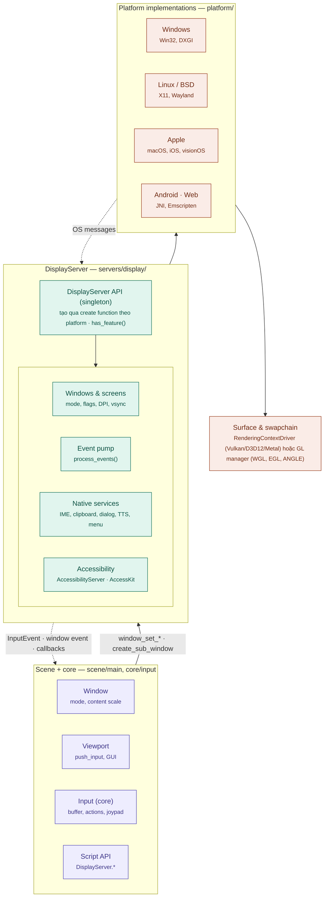
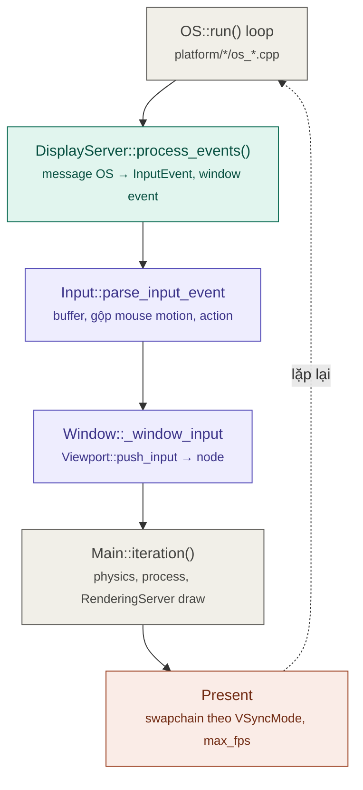
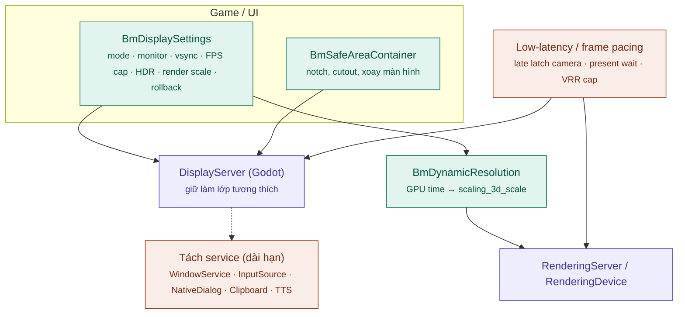

# Kiến trúc hệ thống Display (Godot → Bamboo Engine)

> Phân tích dựa trên source code thực trong repo `bamboo` (Godot 4.8-dev): `servers/display/`, `platform/*/display_server_*`, `scene/main/window.*`, `core/input/`, `main/main.cpp`.
> Tài liệu liên quan: [architecture.md](architecture.md), [Render_Architecture.md](Render_Architecture.md), [Camera_Architecture.md](Camera_Architecture.md), [Navigation_Architecture.md](Navigation_Architecture.md).

---

## 1. Mô hình tổng quát

`DisplayServer` là **lớp trung gian giữa engine và hệ thống cửa sổ của OS**. Một interface (`servers/display/display_server.h`) gánh 4 vai trò:

| Vai trò | Nội dung | API tiêu biểu |
| :--- | :--- | :--- |
| 1. **Cửa sổ & màn hình** | Tạo/hủy cửa sổ, mode, flag, vị trí, kích thước, DPI, refresh rate, safe area, cutout, orientation | `create_sub_window`, `window_set_mode`, `window_set_flag`, `window_set_vsync_mode`, `screen_get_dpi/scale/refresh_rate`, `get_display_safe_area`, `get_display_cutouts` |
| 2. **Event pump** | Đọc message OS → `InputEvent` + window event | `process_events()`, `window_set_input_event_callback`, `window_set_window_event_callback`, `window_set_rect_changed_callback` |
| 3. **Dịch vụ native** | Bàn phím ảo, IME, clipboard, cursor, dialog, file/color picker, TTS, dark mode, native menu, status indicator | `virtual_keyboard_show`, `window_set_ime_*`, `clipboard_*`, `cursor_set_shape`, `dialog_show`, `file_dialog_show`, `color_picker`, `tts_speak` |
| 4. **Accessibility** | Cây accessibility cho screen reader (`AccessibilityServer`, driver AccessKit) | `accessibility_create_element`, `accessibility_update_set_*` |

Ngoài ra, mỗi `DisplayServer` **tạo surface vẽ cho từng cửa sổ**: `RenderingContextDriver` (Vulkan / D3D12 / Metal) hoặc GL manager (WGL, EGL, ANGLE); nó giữ `RenderingDevice` và gọi `screen_create(window_id)` khi tạo cửa sổ (`platform/windows/display_server_windows.cpp:1935-2007`).

### 1.1 Sơ đồ kiến trúc

### 1.2 Cách engine chọn DisplayServer

- Mỗi platform đăng ký create function: `DisplayServer::register_create_function(name, create, get_rendering_drivers)`.
  - Linux: `x11`, `wayland`. Mọi platform có thêm `headless` (`NULL_DISPLAY_DRIVER`) và `embedded` khi chạy game nhúng trong editor (`main/main.cpp:294-295`).
- `Main::setup2()` chọn display driver theo `--display-driver` hoặc project setting, kiểm tra rendering driver tương thích qua `get_create_function_rendering_drivers()`, rồi tạo singleton.
- `has_feature(Feature)` (`servers/display/display_server_enums.h:43`) cho game/editor hỏi platform hỗ trợ gì — hơn 35 feature, gồm `FEATURE_SUBWINDOWS`, `FEATURE_TOUCHSCREEN`, `FEATURE_IME`, `FEATURE_HIDPI`, `FEATURE_WINDOW_TRANSPARENCY`, `FEATURE_NATIVE_DIALOG_FILE`, `FEATURE_TEXT_TO_SPEECH`, `FEATURE_WINDOW_EMBEDDING`, `FEATURE_ACCESSIBILITY_SCREEN_READER`, `FEATURE_HDR_OUTPUT`, `FEATURE_PIP_MODE`, …

| Platform | File | Kích thước |
| :--- | :--- | :--- |
| Windows | `platform/windows/display_server_windows.cpp` | ~8.7k dòng |
| X11 | `platform/linuxbsd/x11/display_server_x11.cpp` | ~7.6k dòng |
| macOS | `platform/macos/display_server_macos.mm` (+ `_embedded`) | ~4.1k dòng |
| Wayland | `platform/linuxbsd/wayland/display_server_wayland.cpp` | ~2.6k dòng |
| iOS / visionOS / Android / Web | `platform/<name>/display_server_<name>.*` | — |

### 1.3 Window & Viewport (phía scene)

- `Window` (`scene/main/window.h`) kế thừa `Viewport`; mỗi `Window` không nhúng tương ứng một `WindowID` của DisplayServer. Root của `SceneTree` là `Window` chính (`MAIN_WINDOW_ID`).
- **Subwindow**: popup/dialog/cửa sổ phụ là cửa sổ OS thật, hoặc được **nhúng** vẽ trong cửa sổ cha (`display/window/subwindows/embed_subwindows`). Platform không có `FEATURE_SUBWINDOWS` (mobile, web) luôn nhúng.
- **Content scale** — quyết định game trông thế nào ở 720p / 4K / ultrawide / điện thoại:
  - `content_scale_mode`: `disabled` / `canvas_items` / `viewport`
  - `content_scale_aspect`: `ignore` / `keep` / `keep_width` / `keep_height` / `expand`
  - `content_scale_stretch`: `fractional` / `integer` (pixel art)
  - `content_scale_factor`
- **Modal**: `transient`, `exclusive`, `popup_exclusive_*`.

### 1.4 Cửa sổ, VSync, HDR

- `WindowMode`: `WINDOWED`, `MINIMIZED`, `MAXIMIZED`, `FULLSCREEN` (borderless), `EXCLUSIVE_FULLSCREEN`.
- `WindowFlags`: `RESIZE_DISABLED`, `BORDERLESS`, `ALWAYS_ON_TOP`, `TRANSPARENT`, `NO_FOCUS`, `POPUP`, `EXTEND_TO_TITLE`, `MOUSE_PASSTHROUGH`, `SHARP_CORNERS`, `EXCLUDE_FROM_CAPTURE`, `POPUP_WM_HINT`, `MINIMIZE_DISABLED`, `MAXIMIZE_DISABLED`.
- `WindowEvent`: `MOUSE_ENTER/EXIT`, `FOCUS_IN/OUT`, `CLOSE_REQUEST`, `GO_BACK_REQUEST`, `DPI_CHANGE`, `TITLEBAR_CHANGE`, `FORCE_CLOSE`, `OUTPUT_MAX_LINEAR_VALUE_CHANGED`.
- `VSyncMode` (theo từng cửa sổ, truyền xuống swapchain): `DISABLED`, `ENABLED`, `ADAPTIVE`, `MAILBOX`.
- Độ trễ frame chịu ảnh hưởng của:
  - `rendering/rendering_device/vsync/frame_queue_size`, `swapchain_image_count` (`servers/rendering/rendering_device.cpp`)
  - `application/run/max_fps`, `application/run/low_processor_mode`
  - Swappy frame pacing (chỉ Android, `thirdparty/swappy-frame-pacing`)
- **HDR output** (`FEATURE_HDR_OUTPUT`): Windows, macOS, Wayland. Điều khiển qua `RenderingContextDriver` (`window_set_hdr_output_enabled`, reference / max luminance); phát `WINDOW_EVENT_OUTPUT_MAX_LINEAR_VALUE_CHANGED` khi màn hình đổi.

---

## 2. Vòng lặp sự kiện & một frame

`OS_*::run()` của mỗi platform (vd. `platform/windows/os_windows.cpp:2355`) là vòng lặp ngoài cùng của engine.

- **`process_events()`**: chạy một lần trước mỗi frame. Windows đọc bằng `PeekMessageW`; chuột captured đọc qua Raw Input (`RegisterRawInputDevices`, `WM_INPUT`).
- **`Input`** (`core/input/input.h`):
  - `use_accumulated_input`: gộp nhiều mouse motion trong một frame.
  - `buffered_events` được xả bằng `flush_buffered_events()`.
  - `agile_input_event_flushing` (một số platform): xả input ngay trong vòng lặp physics để giảm trễ.
  - Giữ `InputMap` (action), trạng thái joypad/sensor; gamepad qua SDL3 (`drivers/sdl`).
- **Window → Viewport**: `Window::_window_input` (`scene/main/window.cpp:2013`) → `Viewport::push_input`, phân phối theo thứ tự: `_input` → GUI (`Control::_gui_input`) → `_shortcut_input` → `_unhandled_key_input` → `_unhandled_input` → physics picking.
- **Present**: swapchain trình chiếu theo `VSyncMode`; nếu đặt `max_fps`, engine sleep để giữ nhịp; rồi quay lại `process_events()`.

---

## 3. Những điểm còn thiếu của hệ thống hiện tại

| # | Vấn đề | Hệ quả cho game |
| :--- | :--- | :--- |
| 1 | `DisplayServer` **gộp quá nhiều trách nhiệm** (cửa sổ, input, dialog, TTS, menu, accessibility); mỗi bản platform rất lớn | Port console / nền tảng mới tốn công; khó strip phần không cần cho game |
| 2 | Input chỉ đọc **ở đầu frame**; không có late latching hay chế độ low-latency kiểu Reflex/Anti-Lag | Độ trễ input-to-photon cao cho game hành động / FPS |
| 3 | Frame pacing desktop chỉ dựa vsync + `max_fps` (sleep); Swappy chỉ có trên Android | Micro-stutter, nhất là khi FPS nằm giữa các mức refresh |
| 4 | **Không có API liệt kê/đổi độ phân giải màn hình**; exclusive fullscreen dùng độ phân giải desktop | Không có menu "Resolution" truyền thống; phải đi qua render scale |
| 5 | **Không có dynamic resolution** tự động theo GPU time (`scaling_3d_scale` chỉnh tay) | FPS dao động mạnh khi cảnh nặng |
| 6 | HDR output chưa có trên Android/iOS; chưa có màn hình hiệu chỉnh HDR chuẩn | Trải nghiệm HDR không đồng nhất |
| 7 | Không có node/container chuẩn cho **safe area / notch** (chỉ có `get_display_safe_area`) | Mỗi game mobile tự xử lý tai thỏ, thanh điều hướng |
| 8 | Không có module **Display settings** chuẩn (màn hình, chế độ cửa sổ, vsync, FPS cap, HDR, render scale, lưu/áp dụng) | Mỗi game tự viết menu cài đặt và lưu config |

---

## 4. Đề xuất nâng cấp cho Bamboo

Các đề xuất dưới đây là **định hướng kỹ thuật**, chưa phải tính năng có sẵn. Tên lớp `Bm*` là tên tạm.

### 4.1 Kiến trúc đề xuất

### 4.2 Ngắn hạn — module, không sửa lõi

1. **`BmDisplaySettings`** — module chuẩn quản lý: chế độ cửa sổ, chọn màn hình, vsync, FPS cap, render scale / FSR, HDR on/off + độ sáng.
   - Lưu `user://display.cfg`, áp dụng khi khởi động.
   - Rollback sau 15 giây nếu người chơi không xác nhận.
   - Dùng `has_feature()` để ẩn tùy chọn không hỗ trợ trên platform hiện tại.
2. **`BmSafeAreaContainer`** — `Container` tự thêm lề theo `get_display_safe_area()` / `get_display_cutouts()`, cập nhật khi xoay màn hình (`size_changed` / window event).
3. **Preset content scale theo thể loại**, đóng gói thành template dự án Bamboo:
   - Pixel art: `viewport` + `integer` stretch.
   - UI-heavy: `canvas_items` + `expand`.
   - Mobile dọc: aspect `keep_width`.
4. **Strip DisplayServer theo sản phẩm**: `build_profile`, `accesskit=no`, `wayland=no` / `x11=no` khi không cần → giảm binary và bề mặt bug (xem [ENGINE_ANALYSIS.md §4.1](ENGINE_ANALYSIS.md)).

### 4.3 Trung hạn — patch nhỏ vào display / render

5. **Dynamic resolution scaling**: controller đọc GPU time từ timestamp `RSG::utilities` (đã có), điều chỉnh `scaling_3d_scale` theo mục tiêu ms/frame, kết hợp FSR2 / upscaler (xem [Render_Architecture.md §4](Render_Architecture.md)).
6. **Chế độ low-latency**:
   - Late latch: đọc lại chuột/gamepad ngay trước khi gửi camera transform cho renderer (chỉ cho camera, không cho gameplay).
   - Chờ present đúng lúc: DXGI frame latency waitable object (D3D12), `VK_KHR_present_wait` (Vulkan).
   - Preset "Low latency" trong `BmDisplaySettings` đặt `frame_queue_size = 1`.
7. **Frame pacing desktop**: pacing theo dự đoán thời điểm present thay vì sleep thô; hỗ trợ VRR (G-Sync/FreeSync) bằng cách cap FPS thấp hơn refresh vài khung để luôn nằm trong vùng VRR.
8. **HDR đồng nhất**: bổ sung HDR output cho Android/iOS qua `RenderingContextDriver`; thêm màn hình hiệu chỉnh HDR chuẩn (paper white, peak luminance).

### 4.4 Dài hạn — thay đổi kiến trúc

9. **Tách DisplayServer thành service nhỏ** trong fork Bamboo: `WindowService`, `InputSource`, `NativeDialogService`, `ClipboardService`, `TTSService`; giữ `DisplayServer` làm lớp tương thích (facade).
   - Port console chỉ cần `WindowService` + `InputSource` tối thiểu.
   - Bản game có thể bỏ hẳn dialog / TTS / menu.
10. **Template "Minimal DisplayServer"** cho console / thiết bị đặc thù: một cửa sổ fullscreen, không dialog/clipboard, input chỉ gamepad — khung chuẩn để port nhanh.
11. **Input thread riêng**: đọc input trên thread riêng với timestamp chính xác, áp vào đúng physics tick (input theo thời gian, không theo frame) — hữu ích cho rhythm game, fighting game, multiplayer rollback.

### 4.5 Thứ tự ưu tiên khuyến nghị

| Thứ tự | Hạng mục | Lý do |
| :--- | :--- | :--- |
| 1 | `BmDisplaySettings` (#1) | Mọi game đều cần; không sửa lõi |
| 2 | `BmSafeAreaContainer` + preset content scale (#2, #3) | Bắt buộc cho mobile, chi phí thấp |
| 3 | Dynamic resolution (#5) | Ổn định FPS, người chơi cảm nhận rõ |
| 4 | Low-latency + frame pacing (#6, #7) | Độ mượt và độ nhạy cho game PC / hành động |
| 5 | HDR đồng nhất (#8) | Theo nhu cầu nền tảng |
| 6+ | #9–#11 | Khi bắt đầu port console hoặc làm thể loại cần input chính xác |

### 4.6 Nguyên tắc khi sửa display trong fork Bamboo

- **Không đổi API công khai của `DisplayServer` / `Window`** — editor, script và addon phụ thuộc; thêm tính năng qua `has_feature()` mới và hàm mới.
- Mọi tính năng mới phải có **fallback khi platform không hỗ trợ** (kiểm tra `has_feature()`), và hoạt động với `headless`.
- Patch trong `platform/*/display_server_*` đánh dấu `// BAMBOO:`, gom commit riêng theo tính năng, và làm đồng thời cho các platform mục tiêu.
- Kiểm thử trên ma trận: Windows (Vulkan/D3D12), Linux (X11/Wayland), macOS (Metal), Android, Web — với vsync bật/tắt và HiDPI.
