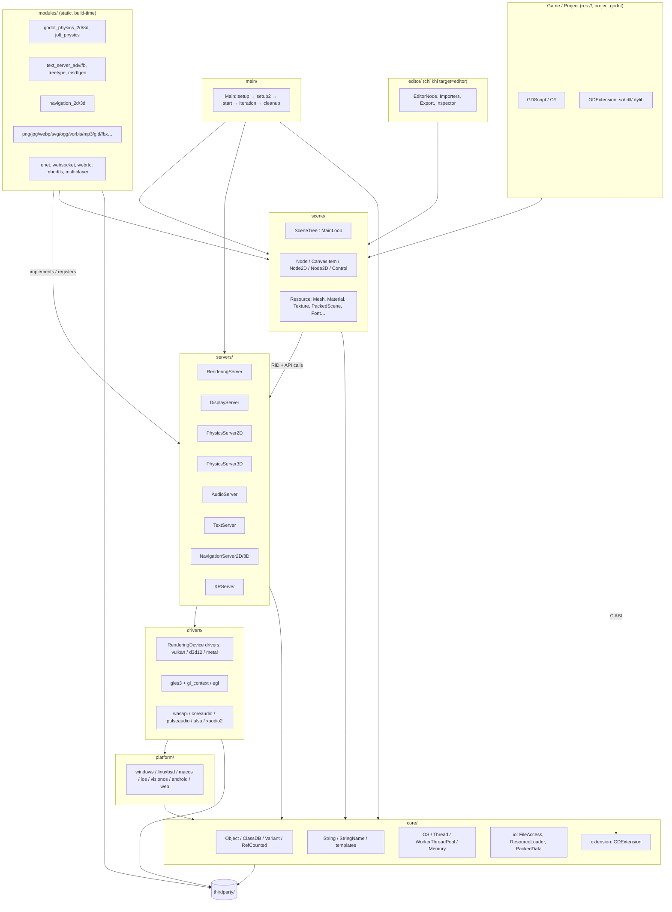
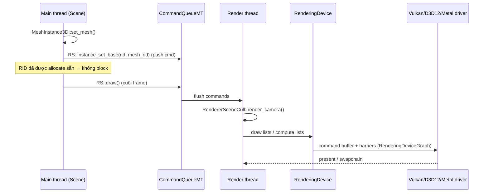
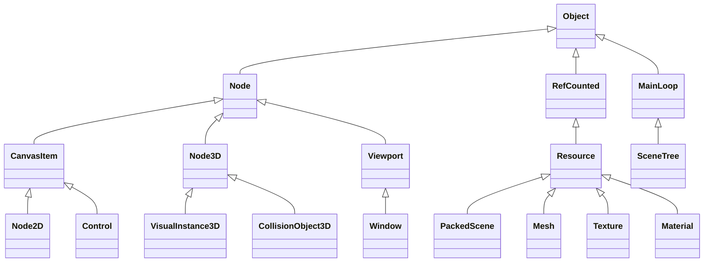
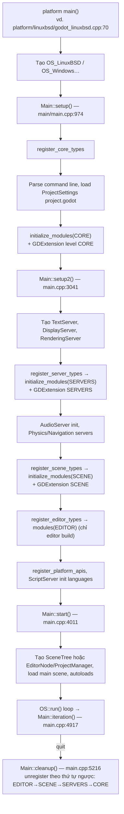

# Báo cáo kỹ thuật: Phân tích & tái kiến trúc Godot Engine → Bamboo Engine

> Nguồn phân tích: repo `bamboo` (fork Godot, nhánh `master` @ `c24bf5d933`, `version.py` = **4.8-dev**).
> Mọi đường dẫn file trong báo cáo đều là đường dẫn thực trong repo này.

---

## 1. Tech Stack

### 1.1 Ngôn ngữ & chuẩn

| Hạng mục | Chi tiết | Bằng chứng trong code |
| :--- | :--- | :--- |
| Ngôn ngữ lõi | **C++17** (engine), **C17** (thirdparty C code) | `SConstruct:918-924` — `-std=gnu++17` / `/std:c++17` |
| Exceptions / RTTI | Exceptions **tắt mặc định** (`disable_exceptions=yes`), engine dùng macro `ERR_FAIL_*` thay cho throw | `SConstruct:277`, `core/error/error_macros.h` |
| Build scripting | **Python 3** (SCons + code generator `*_builders.py`, `make_*.py`) | `SConstruct`, `methods.py`, `core/core_builders.py`, `glsl_builders.py`, `gles3_builders.py` |
| Scripting cho game | **GDScript** (`modules/gdscript`), **C#/.NET** (`modules/mono`, tắt mặc định), **GDExtension** (C ABI → C++/Rust/… qua binding) | `modules/gdscript`, `modules/mono`, `core/extension` |
| Shader | **Godot Shading Language** (dạng GLSL) → transpile bởi `servers/rendering/shader_compiler.cpp`; shader nội bộ viết **GLSL** (`*.glsl`) | `servers/rendering/renderer_rd/shaders`, `drivers/gles3/shaders` |
| Shader backend | GLSL → **SPIR-V** (glslang) → Vulkan; SPIR-V → **MSL** (SPIRV-Cross) cho Metal; SPIR-V → **DXIL** cho D3D12 (qua Mesa NIR, tải bằng `misc/scripts/install_d3d12_sdk_windows.py`); GLSL ES 3.0 cho GLES3/WebGL2 | `modules/glslang`, `drivers/metal`, `drivers/d3d12` |
| Platform glue | **Java/Kotlin** (Android, `platform/android/java`), **Objective-C++** (`*.mm` macOS/iOS/visionOS), **JavaScript** (Web, `platform/web/js`) | |

### 1.2 Build system & toolchain

- **SCons** là hệ build duy nhất. Cấu trúc:
  - `SConstruct` — entry: khai báo option, detect platform, load module, set flags.
  - `platform/<name>/detect.py` — `can_build()`, `get_opts()`, `configure(env)` cho từng nền tảng.
  - `SCsub` ở mỗi thư mục — khai báo source, thư viện thirdparty.
  - `modules/<name>/config.py` — `can_build()`, `configure()`, `get_doc_classes()`.
  - Code generation lúc build: `*.gen.h/*.gen.cpp` (ví dụ `modules/register_module_types.gen.cpp`, `core/disabled_classes.gen.h`, `core/version_generated.gen.h`).
- Tăng tốc build: `scu_build=yes` (single compilation unit), `ninja=yes`, `cache_path=…`, `c/cpp_compiler_launcher=ccache`, `compiledb=yes` (sinh `compile_commands.json` cho clangd).
- Compilers hỗ trợ:

| Nền tảng | Compiler |
| :--- | :--- |
| Windows | MSVC (`cl`), MinGW-w64 GCC/LLVM (`use_mingw=yes`, `use_llvm=yes`) |
| Linux/BSD | GCC, Clang (`use_llvm=yes`), tuỳ chọn `linker=mold/lld` |
| macOS / iOS / visionOS | Apple Clang (Xcode SDK), có thể cross-compile qua OSXCross |
| Android | Clang từ **Android NDK**, đóng gói APK/AAB bằng Gradle |
| Web | **Emscripten** (emcc → WebAssembly), `threads=yes/no`, `dlink_enabled` cho GDExtension |

### 1.3 Low-level Graphics APIs

Kiến trúc render có 2 nhánh:

```
RenderingServer
 ├── RendererRD (dùng RenderingDevice — API "explicit" tự viết của Godot)
 │    ├── Forward+ (forward_clustered)  — desktop high-end
 │    └── Mobile   (forward_mobile)     — mobile / VR
 │    RenderingDeviceDriver:
 │       ├── Vulkan 1.x   (drivers/vulkan, volk, VMA trong thirdparty/vulkan)
 │       ├── Direct3D 12  (drivers/d3d12, D3D12MA, DirectX-Headers)
 │       └── Metal        (drivers/metal, metal-cpp)  — Apple arm64
 └── RasterizerGLES3 "Compatibility" (drivers/gles3)
        ├── OpenGL 3.3 / OpenGL ES 3.0 (glad loader)
        ├── WebGL 2 (Web)
        └── ANGLE (GLES → D3D11/Metal trên Windows/macOS)
```

Cờ SCons: `vulkan`, `d3d12`, `metal`, `opengl3`, `angle`, `forward_plus_renderer`, `forward_mobile_renderer` (`SConstruct:204-212`).

### 1.4 Platform abstraction

- Tầng trừu tượng: **`OS`** (`core/os/os.h` — file, thời gian, thread, process), **`DisplayServer`** (`servers/display/display_server.h` — window, input, clipboard, IME), **`AudioDriver`**, **`MIDIDriver`**, `DirAccess`/`FileAccess`.
- Mỗi nền tảng trong `platform/` cung cấp: `OS_<X>`, `DisplayServer<X>`, entry `main()`, và `export/` plugin cho editor.

| Platform | Thư mục | Display | Audio | GPU |
| :--- | :--- | :--- | :--- | :--- |
| Windows | `platform/windows` | Win32 | WASAPI, XAudio2 (opt) | Vulkan, D3D12, GL/ANGLE |
| Linux/*BSD | `platform/linuxbsd` | X11, Wayland | PulseAudio, ALSA | Vulkan, GL/EGL |
| macOS | `platform/macos` | Cocoa | CoreAudio | Metal, Vulkan (MoltenVK), GL/ANGLE |
| iOS | `platform/ios` (+ `drivers/apple_embedded`) | UIKit | CoreAudio | Metal, Vulkan (MoltenVK), GLES3 |
| visionOS | `platform/visionos` | UIKit | CoreAudio | Metal |
| Android | `platform/android` | JNI + Java host | OpenSL / AAudio | Vulkan, GLES3 |
| Web | `platform/web` | Emscripten/DOM | WebAudio (AudioWorklet) | WebGL2 |
| Consoles | **không có trong source mở** | — | — | Port qua bên thứ 3 có NDA với Sony/Nintendo/Microsoft; tái sử dụng cùng pattern `platform/<name>` |

Input bổ sung: **SDL3** chỉ dùng cho gamepad (`drivers/sdl`), **AccessKit** cho screen reader (`drivers/accesskit`).

---

## 2. Kiến trúc module & layer

### 2.1 Sơ đồ tổng thể



Quy tắc phụ thuộc (được enforce bởi convention, không phải compiler): `core` ← `servers` ← `scene` ← `editor`. `servers` **không** được include `scene`. `drivers`/`modules` có thể phụ thuộc vào mọi layer thấp hơn tuỳ vai trò.

### 2.2 Core Layer (`core/`)

| Thành phần | File chính | Ghi chú kiến trúc |
| :--- | :--- | :--- |
| **Memory** | `core/os/memory.h/.cpp` | `memnew/memdelete`, `memalloc/memfree`; header ẩn chứa size/refcount (`Memory::alloc_static` với `pad_align`). Allocator phụ: `core/templates/paged_allocator.h`, `rid_owner.h` (pool cho RID). Container: `Vector<T>`/`CowData` (**copy-on-write**), `LocalVector`, `HashMap`, `AHashMap`. |
| **Object model** | `core/object/object.h` | Mọi class kế thừa `Object`, macro `GDCLASS(Derived, Base)`. Có signal/slot, notification (`_notification(int)`), metadata, property reflection, script instance. `ObjectDB` ánh xạ `ObjectID` → pointer (weak ref an toàn). |
| **ClassDB** | `core/object/class_db.h` | Reflection runtime: `_bind_methods()` → `ClassDB::bind_method`, `ADD_PROPERTY`, `ADD_SIGNAL`, `BIND_ENUM_CONSTANT`. Là nguồn cho GDScript, C#, GDExtension và docs. `GDREGISTER_CLASS / GDREGISTER_ABSTRACT_CLASS / GDREGISTER_VIRTUAL_CLASS`. Có thể disable class lúc build (`build_profile` → `disabled_classes.gen.h`). |
| **Variant** | `core/variant/variant.h` | Tagged union ~40 kiểu (bool, int, float, String, Vector2/3/4, Transform, Color, StringName, NodePath, RID, Object, Callable, Signal, Dictionary, Array, Packed*Array). Operator/constructor/method call được dispatch bằng bảng (`variant_op.cpp`, `variant_call.cpp`). `Variant` là "lingua franca" giữa C++ ↔ script ↔ extension. |
| **RefCounted** | `core/object/ref_counted.h` | Đếm tham chiếu intrusive (`SafeRefCount`) + smart pointer `Ref<T>`. `Resource` kế thừa `RefCounted`. Node **không** RefCounted (được sở hữu bởi cây). |
| **String** | `core/string/ustring.h` | `String` = UTF-32 (`char32_t`) trên `CowData`; `CharString`(UTF-8/ASCII), `Char16String`. Float→string dùng grisu2. |
| **StringName** | `core/string/string_name.h` | Chuỗi được **intern** vào bảng hash toàn cục → so sánh bằng pointer O(1); dùng cho tên method/property/signal. `SNAME("...")` cache static. |
| **Threading** | `core/os/thread.h`, `mutex.h`, `rw_lock.h`, `semaphore.h`, `spin_lock.h`, `core/object/worker_thread_pool.h`, `core/templates/command_queue_mt.h` | `WorkerThreadPool` là job system chung (task & group task). `CommandQueueMT` là ring buffer lệnh cho server chạy thread riêng. `MessageQueue` (`core/object/message_queue.h`) cho `call_deferred`. |
| **IO / Resource** | `core/io/resource_loader.h`, `resource_saver.h`, `file_access_pack.h`, `config_file.h` | `ResourceFormatLoader/Saver` plug-in được; `.pck` + `PackedData` là VFS `res://`. `ResourceUID` (`uid://`). |
| **Config** | `core/config/project_settings.h`, `engine.h` | Load `project.godot` / `project.binary`, `override.cfg`; `Engine` giữ singletons & thông tin runtime. |
| **Extension** | `core/extension/` | GDExtension (xem §2.6). |

### 2.3 Server Layer (`servers/`)

Nguyên tắc thiết kế:
1. **Data-driven qua RID**: scene không giữ object GPU/physics; nó giữ `RID` (opaque handle) và gọi API server (`RenderingServer::mesh_create()`, `instance_set_transform(rid, xform)`…). Server lưu dữ liệu trong `RID_Owner<T>` (pool liên tục, cache-friendly).
2. **Singleton + interface ảo**: `RenderingServer`, `PhysicsServer3D`… là class abstract; implementation được chọn lúc runtime qua **Manager** (`PhysicsServer3DManager`, `TextServerManager`, `NavigationServer3DManager`) → cho phép thay engine vật lý mà không đụng scene.
3. **Multi-thread qua command queue**: `servers/server_wrap_mt_common.h` sinh macro `FUNC1(...)`/`FUNCRIDSPLIT` bọc mỗi API: nếu gọi từ thread khác thread server → đẩy lệnh vào `CommandQueueMT`; RID được **cấp trước** (`*_allocate` + `*_initialize`) để không phải chờ. `RenderingServerDefault` (`servers/rendering/rendering_server_default.h`) dùng cơ chế này khi `rendering/driver/threads/thread_model = Separate`. Physics 3D có `run_on_separate_thread`.

| Server | Vai trò | Implementation / Driver |
| :--- | :--- | :--- |
| `RenderingServer` | Scene cull, viewport, canvas, material/shader, lights, GI | `RendererSceneCull`, `RendererCanvasCull`, `RendererViewport` → `RendererCompositor` (`renderer_rd` hoặc `drivers/gles3`) → `RenderingDevice` → `RenderingDeviceDriver{Vulkan,D3D12,Metal}`. Có `RenderingDeviceGraph` (tự sắp xếp barrier/pass). |
| `DisplayServer` | Window, input event, cursor, IME, native dialog | Mỗi platform tự implement; `display_server_headless` cho server/CI. |
| `PhysicsServer2D/3D` | Body, shape, space, joint, query | `modules/godot_physics_2d`, `modules/godot_physics_3d`, `modules/jolt_physics` (mặc định 3D mới). |
| `AudioServer` | Bus, effect, mixer thread | `AudioDriver` platform (WASAPI/CoreAudio/Pulse/ALSA/OpenSL/Web). Mixing chạy trên thread audio riêng. |
| `TextServer` | Shaping, BiDi, font raster | `text_server_adv` (HarfBuzz+ICU+Graphite+FreeType) hoặc `text_server_fb` (fallback nhẹ). |
| `NavigationServer2D/3D` | Navmesh, pathfinding, avoidance | `modules/navigation_2d/3d` (Recast/Detour, RVO2). |
| `XRServer` | Tracker, interface AR/VR | `modules/openxr`, `mobile_vr`, `webxr`, `visionos_xr`. |
| `CameraServer`, `MovieWriter`, debugger | Phụ trợ | `servers/camera`, `servers/movie_writer`, `servers/debugger`. |



### 2.4 Scene Layer (`scene/`)

- Cấu trúc thư mục: `scene/main` (Node, SceneTree, Viewport, Window, CanvasItem), `scene/2d`, `scene/3d`, `scene/gui` (Control), `scene/animation`, `scene/audio`, `scene/resources`, `scene/theme`.
- Cây kế thừa chính:



- **SceneTree** (`scene/main/scene_tree.h`) là `MainLoop` mặc định: giữ root `Window`, group, process list, timer, tween, `MultiplayerAPI`. Có `scene_tree_fti` (fixed-timestep interpolation).
- **Lifecycle của Node** (theo `NOTIFICATION_*`):
  1. Constructor / `NOTIFICATION_POSTINITIALIZE`
  2. `add_child()` → `NOTIFICATION_ENTER_TREE` (**top-down**, cha trước con) → `_enter_tree()`
  3. `NOTIFICATION_READY` (**bottom-up**, con xong rồi mới đến cha) → `_ready()` (chỉ 1 lần trừ khi `request_ready()`)
  4. Mỗi frame: `NOTIFICATION_PHYSICS_PROCESS` (fixed step) → `NOTIFICATION_PROCESS` (idle), `NOTIFICATION_INTERNAL_*` cho engine
  5. `NOTIFICATION_DRAW` (CanvasItem, khi `queue_redraw()`)
  6. `remove_child()` → `NOTIFICATION_EXIT_TREE` (**bottom-up**) → `_exit_tree()`
  7. `queue_free()` → xoá cuối frame → `NOTIFICATION_PREDELETE`
- **Resource management**: `ResourceLoader::load()` + `ResourceCache` (1 path ↔ 1 instance), text `.tscn/.tres`, binary `.scn/.res`, import pipeline editor sinh file trong `.godot/imported/` + `.import`. Load bất đồng bộ bằng `ResourceLoader::load_threaded_request()` (dùng `WorkerThreadPool`).

### 2.5 Main entry & lifecycle (`main/`)



**`Main::iteration()`** (một frame):
1. `MainTimerSync::advance()` tính số physics step cần chạy (fixed `physics_ticks_per_second`, chống spiral-of-death bằng `max_physics_steps_per_frame`).
2. `XRServer::_process()`.
3. Lặp mỗi physics step: `PhysicsServer{2D,3D}::sync()` + `flush_queries()` → `SceneTree::physics_process()` (gọi `_physics_process`) → `NavigationServer::physics_process()` → `MessageQueue::flush()` → `PhysicsServer::step()` → `iteration_end()`.
4. `SceneTree::process()` (`_process`, tween, timer) → `MessageQueue::flush()`.
5. `RenderingServer::sync()` / `draw()` (nếu cần redraw).
6. `ScriptServer::frame()`, `GDExtensionManager::frame()`, `EngineDebugger::iteration()`, frame pacing / `delta` smoothing.

### 2.6 Module extensibility

**A. Static C++ module (build-time)** — `modules/<name>/`:
```
modules/my_module/
├── config.py          # can_build(env, platform), configure(env), get_doc_classes()
├── SCsub              # env_module.add_source_files(...)
├── register_types.h/.cpp
│     void initialize_my_module_module(ModuleInitializationLevel p_level);
│     void uninitialize_my_module_module(ModuleInitializationLevel p_level);
└── doc_classes/*.xml
```
- `modules/modules_builders.py` sinh `register_module_types.gen.cpp` gọi hàm init theo 4 level: `CORE → SERVERS → SCENE → EDITOR`.
- Bật/tắt: `module_<name>_enabled=yes/no`, module ngoài repo: `custom_modules=../bamboo_modules`.
- Ưu điểm: truy cập toàn bộ internal API, zero-overhead. Nhược: phải build lại engine.

**B. GDExtension (runtime dynamic library)** — `core/extension/`:
- File `.gdextension` (config) → `GDExtensionLibraryLoader` mở `.so/.dll/.dylib`, gọi `entry_symbol`.
- ABI là **C thuần**: engine truyền `GDExtensionInterfaceGetProcAddress`; extension tra cứu hàm theo tên (định nghĩa trong `core/extension/gdextension_interface.json`, header sinh ra `gdextension_interface.gen.h`).
- API class/method xuất bằng `--dump-extension-api` → `extension_api.json`, dùng để sinh binding (godot-cpp, godot-rust…).
- Có cùng 4 initialization level; hỗ trợ hot-reload trong editor.
- **`libgodot`** (`core/extension/libgodot.h`, `godot_instance.h`, `platform/linuxbsd/libgodot_linuxbsd.cpp`): build engine thành **thư viện nhúng** vào host app khác — rất đáng chú ý cho custom engine (đảo ngược quyền điều khiển main loop).

---

## 3. Audit thư viện bên thứ 3 (`thirdparty/`)

Coupling level: **Critical** = không thể tách nếu không viết lại lõi · **High** = cần cho tính năng nền tảng (text, ảnh, GPU) · **Medium** = tắt được nhưng mất tính năng quan trọng/phải thay thế · **Low** = tắt bằng cờ SCons, không ảnh hưởng lõi.

### 3.1 Graphics & Vector rendering

| Thư viện | Version | Mục đích | Phụ thuộc bởi | Coupling |
| :--- | :--- | :--- | :--- | :--- |
| vulkan (headers + VMA) | SDK 1.4.335 | Header Vulkan, Vulkan Memory Allocator | `drivers/vulkan`, `drivers/apple_embedded`, `modules/ktx` | High (nếu dùng Vulkan) · tắt `vulkan=no` |
| volk | SDK 1.4.335 | Load Vulkan loader động | `drivers/vulkan` | Low (`use_volk=no`) |
| glslang | SDK 1.4.335 | Compile GLSL → SPIR-V lúc runtime | `modules/glslang` | High cho RD renderer (bỏ được nếu pre-compile shader & tắt Vulkan/D3D12) |
| spirv-headers / spirv-reflect | SDK 1.4.335 | Reflect uniform/binding từ SPIR-V | `servers/rendering/renderer_rd`, `drivers/vulkan|metal` | High (RD) |
| spirv-cross | git | SPIR-V → MSL | `drivers/metal`, `platform/macos|ios|visionos` | Medium (chỉ Metal) |
| re-spirv | git | Tối ưu/specialize SPIR-V | `drivers/vulkan` | Low |
| d3d12ma, directx_headers | 3.1.0 / main | Allocator & header D3D12 | `drivers/d3d12` | Low (`d3d12=no` mặc định) |
| metal-cpp, offset_allocator | 26.0 / git | Binding C++ cho Metal, allocator heap | `drivers/metal` | Medium (chỉ Apple) |
| glad | 2.0.8 | Loader OpenGL/GLES/EGL/GLX | `drivers/gl_context`, `platform/linuxbsd/x11`, `modules/openxr` | High cho Compatibility · `opengl3=no` |
| angle | chromium/5907 (prebuilt tuỳ chọn) | GLES trên D3D11/Metal | `platform/windows`, `platform/macos` | Low (`angle=no`) |
| amd-fsr, amd-fsr2 | 1.0.2 / 2.2.1 | Upscaling FSR1/FSR2 | `servers/rendering/renderer_rd/effects` | Medium (nhúng trong shader RD) |
| smaa | git 2013 | Anti-aliasing SMAA | `renderer_rd/effects` | Medium |
| freetype | 2.14.3 | Raster font vector → bitmap | `modules/freetype`, `text_server_adv/fb`, `msdfgen` (không phải `scene/resources/font.cpp` trực tiếp — scene đi qua `TextServer`) | **High** (UI/Text) |
| harfbuzz | 14.4.0 | Text shaping (ligature, script phức) | `modules/text_server_adv`, `modules/freetype` | Medium (dùng `text_server_fb` nếu chỉ Latin) |
| icu4c | 78.3 | BiDi, line-break, Unicode data | `text_server_adv` | Medium (nặng ~ vài MB data) |
| graphite | 1.3.14 | Shaping font Graphite (SIL) | `text_server_adv` | Low (`graphite=no`) |
| msdfgen | 1.13 | Multi-channel SDF font | `modules/msdfgen`, text servers | Low |
| thorvg | 1.0.3 | Raster SVG (icon, SVG texture, emoji font) | `modules/svg`, text servers | Medium (editor cần; runtime tắt được `module_svg_enabled=no`) |
| fonts | — | Font mặc định (Noto, Open Sans, JetBrains Mono…) | `scene/theme`, `editor/themes`, `platform/web` | High cho default theme (thay được) |
| meshoptimizer | 1.2 | LOD, simplification, vertex cache | `modules/meshoptimizer` | Low (import 3D) |
| xatlas | git | UV2 unwrap cho lightmap | `modules/xatlas_unwrap` (editor-only) | Low |
| embree | 4.4.0 | Raycast CPU cho occlusion culling, lightmap | `modules/raycast` (x86_64/arm64) | Low |
| manifold | 3.5.2 | Boolean mesh cho CSG | `modules/csg` | Low |
| clipper2 | 1.5.4 | Boolean/offset polygon 2D | `core` (`Geometry2D`) | High (lõi, nhẹ) |
| ufbx | 0.23.0 | Import FBX | `modules/fbx` | Low |

### 3.2 Physics & Geometry / AI

| Thư viện | Version | Mục đích | Phụ thuộc bởi | Coupling |
| :--- | :--- | :--- | :--- | :--- |
| jolt_physics | 5.6.0 | Physics 3D hiệu năng cao | `modules/jolt_physics` | Low (thay bằng `godot_physics_3d`) |
| *GodotPhysics 2D/3D* | in-house | Physics mặc định (không phải thirdparty) | `modules/godot_physics_2d/3d` | Medium (2D chỉ có một backend) |
| vhacd | git 2020 | Convex decomposition | `modules/vhacd` | Low |
| recastnavigation | 1.6.0 | Build navmesh (Recast) | `modules/navigation_3d` | Low (`disable_navigation_3d=yes`) |
| rvo2 | git | Local avoidance 2D/3D | `modules/navigation_2d|3d` | Low |

### 3.3 Audio & Media

| Thư viện | Version | Mục đích | Phụ thuộc bởi | Coupling |
| :--- | :--- | :--- | :--- | :--- |
| libogg | 1.3.6 | Container Ogg | `modules/ogg`, `vorbis`, `theora` | Medium (nếu dùng .ogg) |
| libvorbis | 1.3.7 | Decode Vorbis | `modules/vorbis`, `theora` | Medium |
| dr_libs (dr_mp3) | mp3-0.7.3 | Decode MP3 | `modules/mp3` | Low |
| libtheora | 1.2.0 | Video Theora (.ogv) | `modules/theora` | Low |
| *WAV* | in-house | `scene/resources/audio_stream_wav` | — | — |

> Không có MiniAudio, Opus, dr_flac trong repo. WebRTC: chỉ có **wrapper** `modules/webrtc` — native cần GDExtension `webrtc-native`, Web dùng API trình duyệt.

### 3.4 Networking & Security

| Thư viện | Version | Mục đích | Phụ thuộc bởi | Coupling |
| :--- | :--- | :--- | :--- | :--- |
| enet | 1.3.18 | UDP reliable cho multiplayer | `modules/enet` | Low (`module_enet_enabled=no`) |
| wslay | 1.1.1+git | WebSocket framing | `modules/websocket` | Low |
| mbedtls | 4.1.1 | TLS/DTLS, crypto (AES, SHA, RSA) | `core/crypto`, `modules/mbedtls` | Medium (HTTPS, `Crypto`, DTLS; tắt được nếu không cần) |
| certs | git 2026 | CA bundle cho TLS | `core` | Low (`builtin_certs=no`) |
| miniupnpc | 2.3.3 | UPnP port-forward | `modules/upnp` | Low |

### 3.5 Compression, Image & Data formats

| Thư viện | Version | Mục đích | Phụ thuộc bởi | Coupling |
| :--- | :--- | :--- | :--- | :--- |
| zlib | 1.3.2 | Deflate (PCK, PNG, ZIP) | `core` | **Critical** |
| zstd | 1.5.7 | Nén resource / PCK / network | `core`, `basis_universal` | **Critical** |
| brotli | 1.2.0 | Giải nén WOFF2 font | `core` | Low (`brotli=no`) |
| minizip | 1.3.2 | Đọc/ghi ZIP | `core`, `modules/zip` | Low (`minizip=no`) |
| pcre2 | 10.47 | `RegEx` | `core` | Medium (API `RegEx` và editor dùng) |
| grisu2 | git | float → string nhanh | `core/string/ustring.cpp` | Critical (nhỏ, không cần tách) |
| libpng | 1.6.58 | PNG | `drivers/png`, `freetype`, `svg` | **High** (icon, splash, import) |
| libjpeg-turbo | 3.1.3 | JPEG | `modules/jpg`, `svg` | Low |
| libwebp | 1.6.0 | WebP (lossless/lossy texture) | `modules/webp`, `svg` | Medium (định dạng nén VRAM-less mặc định) |
| tinyexr | 3.2.0 | EXR HDR | `modules/tinyexr`, `basis_universal` | Low |
| basis_universal | git | Basis/UASTC supercompression | `modules/basis_universal`, `ktx` | Low (encoder editor-only) |
| libktx | 4.4.2 | KTX2 container | `modules/ktx` | Low |
| astcenc, etcpak, cvtt | 5.3.0 / 2.0 / git | Nén texture ASTC / ETC2 / BPTC-S3TC (import) | `modules/astcenc`, `etcpak`, `cvtt` | Low (editor/import) |

### 3.6 Platform & Hardware abstraction / Tooling

| Thư viện | Version | Mục đích | Phụ thuộc bởi | Coupling |
| :--- | :--- | :--- | :--- | :--- |
| openxr | 1.1.63 | Loader OpenXR (VR/AR) | `modules/openxr` | Low (`disable_xr=yes`) |
| sdl | 3.2.28 | Gamepad input | `drivers/sdl` | Low (`sdl=no`, mất hỗ trợ gamepad tốt) |
| gamepadmotionhelpers | git | Sensor fusion gyro/accel gamepad | `core/input/input.cpp` | Low |
| accesskit | 0.22.3 | Accessibility (screen reader) | `drivers/accesskit` | Low (`accesskit=no`) |
| swappy-frame-pacing | git | Frame pacing Android (Vulkan) | `platform/android` | Medium (Android) |
| wayland, wayland-protocols | 1.24 / 1.47 | Client Wayland | `platform/linuxbsd/wayland` | Low (`wayland=no`) |
| linuxbsd_headers | — | Header ALSA/Pulse/X11/udev… để dlopen | `platform/linuxbsd` | High trên Linux |
| libbacktrace | git | Stack trace khi crash | `drivers/backtrace` | Low |
| mingw-std-threads | git | `std::thread` cho MinGW cũ | `core/os/mutex.h`, `rw_lock.h`, `semaphore.h` | Low (chỉ MinGW) |
| doctest | 2.4.12 | Unit test framework | `tests/`, `modules/*/tests` | Low (`tests=no`) |
| misc | — | Snippet nhỏ (ifaddrs Android, polypartition, stb_rect_pack, smolv, FastNoiseLite, …) | `core`, `scene/resources`, `platform/android` | Mixed |

Hầu hết thư viện có cờ `builtin_<lib>=no` để link bản system (hữu ích cho Linux distro, không khuyến nghị cho game ship).

---

## 4. Roadmap tùy biến cho Bamboo Engine

### 4.1 Tối ưu dung lượng binary runtime

**Bước 1 — Template release tối thiểu:**
```bash
scons platform=windows target=template_release production=yes \
      optimize=size_extra lto=full debug_symbols=no deprecated=no
```
- `target=template_release`: loại bỏ `editor/` và `TOOLS_ENABLED`, debug features.
- `production=yes`: bật `lto=auto`, `use_static_cpp`, tắt `debug_symbols` mặc định.
- `optimize=size | size_extra`: `-Os/-Oz` thay cho `-O2`.
- `deprecated=no`: bỏ code compat cũ (`*.compat.inc`).

**Bước 2 — Cắt feature theo loại game:**

| Loại game | Cờ gợi ý |
| :--- | :--- |
| Game 2D thuần | `disable_3d=yes disable_physics_3d=yes disable_navigation_3d=yes disable_xr=yes` |
| Game 3D không UI phức tạp | `disable_advanced_gui=yes` (bỏ Tree, RichTextLabel nâng cao, GraphEdit…) |
| Không multiplayer | `module_enet_enabled=no module_websocket_enabled=no module_webrtc_enabled=no module_multiplayer_enabled=no module_upnp_enabled=no` |
| Chỉ Latin/Việt | `module_text_server_adv_enabled=no module_text_server_fb_enabled=yes` (bỏ ICU + HarfBuzz + Graphite — tiết kiệm lớn nhất) |
| Chỉ một renderer | vd. mobile: `forward_plus_renderer=no opengl3=no d3d12=no`; web: `vulkan=no` |
| Khác | `minizip=no brotli=no accesskit=no sdl=no`, `module_theora_enabled=no module_mp3_enabled=no module_svg_enabled=no` |

**Bước 3 — Whitelist thay vì blacklist:**
```bash
scons ... modules_enabled_by_default=no \
      module_gdscript_enabled=yes module_freetype_enabled=yes \
      module_text_server_fb_enabled=yes module_jolt_physics_enabled=yes \
      module_ogg_enabled=yes module_vorbis_enabled=yes module_webp_enabled=yes
```

**Bước 4 — Build profile theo class:** trong editor `Project → Tools → Engine Compilation Configuration Editor` (hoặc tự viết JSON) → `build_profile=bamboo_game.gdbuild` để disable từng class `ClassDB` không dùng (sinh `core/disabled_classes.gen.h`).

**Bước 5 — Custom options file:** gom cờ vào `custom.py` ở root (SCons tự đọc) hoặc `profile=bamboo_release.py` để CI dùng chung.

### 4.2 Re-branding

| Hạng mục | Vị trí cần sửa |
| :--- | :--- |
| Tên / version | `version.py` (`short_name`, `name`, `website`, `major/minor/patch`) → sinh `core/version_generated.gen.h`; macro `GODOT_VERSION_*` ở `core/version.h` |
| Tên file project & thư mục data | `core/config/project_settings.cpp` (`project.godot`, `project.binary`, `override.cfg`), thư mục `.godot/` (grep `".godot"` trong `core/` và `editor/`), `user://` path trong `core/os/os.cpp` & `OS_*::get_data_path/get_godot_dir_name` |
| Tên binary | `methods.py` / `platform/*/detect.py` (prefix `godot.<platform>.<target>…`), `vsproj_name` |
| Icon / splash / logo | `main/splash.png`, `main/app_icon.png`, `platform/*/logo.svg`, `platform/*/run_icon.svg`, `misc/dist/*` (Info.plist, .desktop, `.ico`, html shell), `editor/icons/` |
| Export templates / plist / manifest | `platform/*/export/*.cpp`, `platform/android/java/` (package `org.godotengine.godot` — đổi namespace Java là việc lớn), `misc/dist/macos_template.app` |
| Web shell | `misc/dist/html/*.html`, `platform/web/js/engine/*.js` (`Engine`/`Godot` global) |
| Tên file đặc thù | `.tscn/.tres/.gdshader/.gdextension/.gd` — **khuyến nghị giữ** để tương thích tool/asset ecosystem |
| Namespace C++ | Godot **không dùng namespace** cho engine class (global). Đổi tên class `ClassDB` (vd. `Node` → `BmNode`) sẽ phá vỡ toàn bộ script/scene/extension — chỉ nên thêm class mới với prefix riêng (`Bamboo*`) trong custom module, và đổi macro `GODOT_*` public |
| GDExtension ABI | `core/extension/gdextension_interface.json`, `extension_api.json` — nếu muốn hệ sinh thái riêng, fork cả godot-cpp; nếu không, giữ nguyên để tái dùng plugin cộng đồng |
| License | Giữ `LICENSE.txt`, `COPYRIGHT.txt` (MIT yêu cầu giữ copyright notice của Godot & thirdparty — `core/license.gen.h` sinh ra từ `COPYRIGHT.txt`) |

Lời khuyên: làm rebrand bằng **một commit tách riêng** + script (`misc/scripts/rebrand.py`) để dễ rebase lên upstream Godot mỗi release.

### 4.3 Chiến lược module hóa

1. **Giữ fork "mỏng", đưa code riêng ra ngoài**
   - Code gameplay/engine riêng → `custom_modules=../bamboo_modules` (repo riêng). Thay đổi vào `core/servers/scene` chỉ khi bắt buộc, gắn tag `// BAMBOO:` để rebase dễ.
   - Theo dõi upstream: branch `upstream/master` + rebase định kỳ theo release 4.x.

2. **Thay renderer** — có 3 mức, từ ít đến nhiều công sức:
   - *Thêm effect/pass*: `CompositorEffect` (script/GDExtension) hoặc chỉnh `servers/rendering/renderer_rd/effects`.
   - *Renderer method mới trên RenderingDevice*: thêm thư mục cạnh `forward_clustered/`, `forward_mobile/` implement `RendererSceneRenderRD`; tái dùng toàn bộ Vulkan/D3D12/Metal driver.
   - *Backend GPU mới* (console, WebGPU): implement `RenderingDeviceDriver` + `RenderingContextDriver` (`servers/rendering/rendering_device_driver.h`) trong `drivers/<api>`, rồi đăng ký ở platform. Đây là con đường các console port dùng.
   - Scene layer không cần sửa vì chỉ nói chuyện với `RenderingServer` qua RID.

3. **Thay physics**: implement `PhysicsServer3D`/`PhysicsServer2D` trong một module (tham khảo `modules/jolt_physics` — ví dụ mẫu tốt nhất về tích hợp engine vật lý bên ngoài), đăng ký qua `PhysicsServer3DManager::register_server()`, chọn bằng project setting `physics/3d/physics_engine`. Có thể làm dưới dạng GDExtension (`PhysicsServer3DExtension`) để không rebuild engine.

4. **Tương tự cho Text/Navigation/Audio**: `TextServerExtension`, `NavigationServer3D` manager, `AudioDriver` mới trong `drivers/`.

5. **Build profiles theo sản phẩm**: mỗi game có `profiles/<game>.py` (cờ SCons) + `<game>.gdbuild` (class whitelist) → CI build template riêng, binary tối ưu từng game.

6. **Cân nhắc `libgodot`** nếu Bamboo cần nhúng engine vào app host (launcher, tool pipeline, app native có sẵn): engine chạy như thư viện, host điều khiển vòng lặp.

7. **Kiểm soát rủi ro**: bật `tests=yes` và chạy `bin/godot.* --test` trong CI sau mỗi lần rebase; dùng `werror=yes` + `compiledb=yes` cho static analysis.

---

### Phụ lục — Lệnh tham khảo nhanh

```bash
scons platform=macos target=editor dev_build=yes compiledb=yes
```
```bash
scons platform=macos target=template_release production=yes optimize=size_extra lto=full disable_3d=yes modules_enabled_by_default=no module_gdscript_enabled=yes module_freetype_enabled=yes module_text_server_fb_enabled=yes
```
```bash
bin/godot.macos.editor.dev.arm64 --headless --dump-extension-api
```
