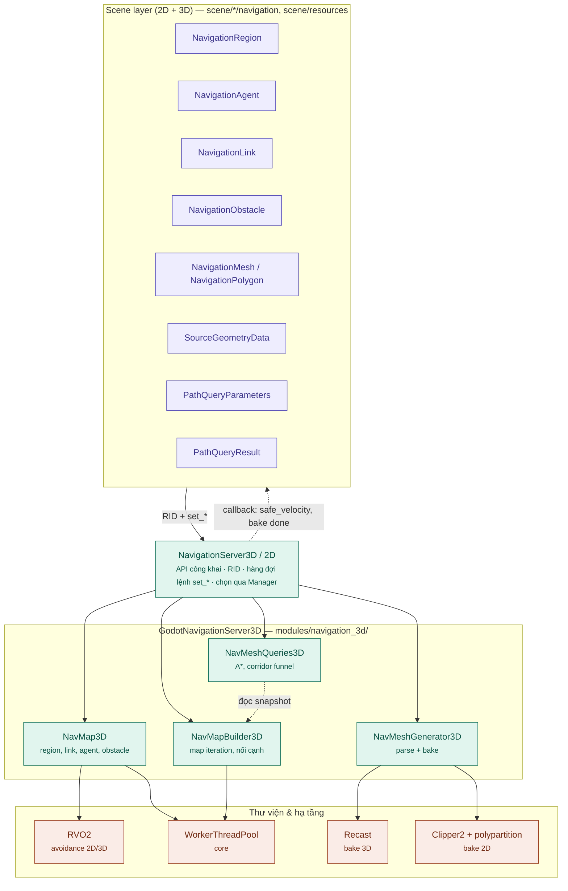
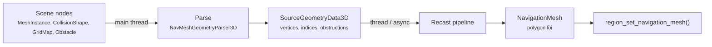
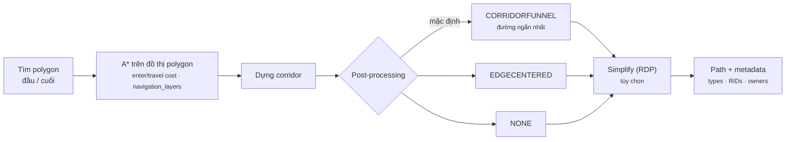
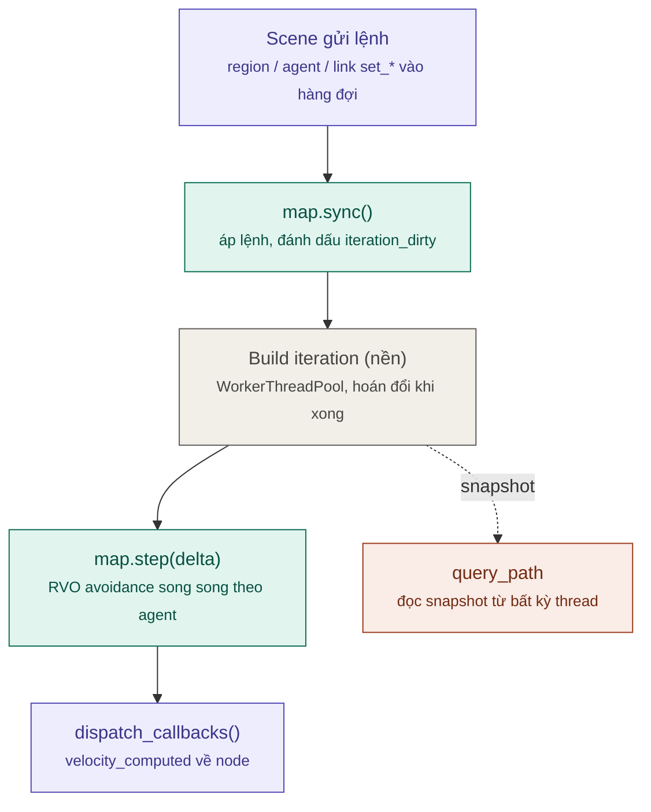
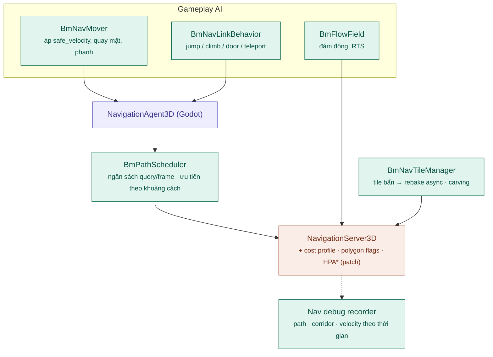

# Kiến trúc hệ thống Navigation (Godot → Bamboo Engine)

> Phân tích dựa trên source code thực trong repo `bamboo` (Godot 4.8-dev): `servers/navigation_3d/`, `servers/navigation_2d/`, `modules/navigation_3d/`, `modules/navigation_2d/`, `scene/3d/navigation/`, `scene/2d/navigation/`.
> Tài liệu liên quan: [architecture.md](architecture.md), [Render_Architecture.md](Render_Architecture.md), [Camera_Architecture.md](Camera_Architecture.md), [ENGINE_ANALYSIS.md](ENGINE_ANALYSIS.md).

---

## 1. Mô hình tổng quát

Navigation là một **server độc lập**, chạy trong bước physics của `Main::iteration()` (xem [architecture.md §6.2](architecture.md)). Nó giải **3 bài toán tách rời**:

| Bài toán | Câu hỏi | Ai làm | Thư viện |
| :--- | :--- | :--- | :--- |
| 1. **Bake** (dựng navmesh) | "Chỗ nào đi được?" | `NavMeshGenerator3D/2D` | Recast (3D), Clipper2 + polypartition (2D) |
| 2. **Pathfinding** (tìm đường) | "Đi từ A tới B theo đường nào?" | `NavMeshQueries3D/2D` — A* trên polygon + funnel | Code riêng của Godot (**không dùng Detour**) |
| 3. **Avoidance** (tránh nhau) | "Đi thế nào để không đâm agent khác?" | `NavMap::step()` | RVO2 (2D và 3D) |

Hệ quả: đường tìm được không biết gì về agent khác; avoidance chỉ chỉnh vận tốc cục bộ và không biết navmesh.

> Godot chỉ dùng phần **Recast** để tạo mesh — `thirdparty/recastnavigation/` chỉ có thư mục `Recast/`. Toàn bộ query (A*, corridor funnel, closest point, random point) là code của Godot trong `modules/navigation_3d/3d/nav_mesh_queries_3d.cpp`.

### 1.1 Sơ đồ kiến trúc

### 1.2 Mô hình dữ liệu (RID)

`servers/navigation_3d/navigation_server_3d.h`:

| Đối tượng server | Node scene tương ứng | Vai trò |
| :--- | :--- | :--- |
| **Map** | `World3D` / `World2D` tự tạo map mặc định | Một "thế giới navigation": `cell_size`, `cell_height`, `edge_connection_margin`, `link_connection_radius`, `up`, `use_edge_connections` |
| **Region** | `NavigationRegion3D/2D` | Một mảnh navmesh + transform, `navigation_layers`, `enter_cost`, `travel_cost` |
| **Link** | `NavigationLink3D/2D` | Cạnh nối đặc biệt giữa 2 điểm (nhảy, thang, teleport) — một/hai chiều |
| **Agent** | `NavigationAgent3D/2D` | Đơn vị di chuyển: radius, height, max_speed, avoidance layers/mask, priority, 2D/3D avoidance |
| **Obstacle** | `NavigationObstacle3D/2D` | Chướng ngại cho avoidance (tĩnh: polygon; động: radius); có thể carve navmesh **chỉ lúc bake** |

- Thay implementation: `NavigationServer3DManager` / `NavigationServer2DManager`; mặc định là `GodotNavigationServer3D` (`modules/navigation_3d/3d/godot_navigation_server_3d.cpp`).
- Tắt hẳn: SCons `disable_navigation_3d=yes` / `disable_navigation_2d=yes`.
- Tách biệt: `core/math/a_star.h` (`AStar2D/3D`) và `core/math/a_star_grid_2d.h` (`AStarGrid2D`) — pathfinding trên đồ thị/lưới thuần, **không** đi qua NavigationServer; phù hợp game ô lưới.

---

## 2. Ba phân hệ chi tiết

### 2.1 Bake navmesh

Recast pipeline (`modules/navigation_3d/3d/nav_mesh_generator_3d.cpp:427-526`):

1. `rcCreateHeightfield` → `rcRasterizeTriangles`
2. Lọc: `rcFilterLowHangingWalkableObstacles`, `rcFilterLedgeSpans`, `rcFilterWalkableLowHeightSpans`
3. `rcBuildCompactHeightfield` → `rcErodeWalkableArea` (co theo agent radius)
4. Chia region: watershed (`rcBuildDistanceField` + `rcBuildRegions`) / monotone / layers
5. `rcBuildContours` → `rcBuildPolyMesh` → `rcBuildPolyMeshDetail`

- Bake 2D (`modules/navigation_2d/2d/nav_mesh_generator_2d.cpp`): boolean polygon bằng Clipper2 + tam giác/lồi hóa bằng polypartition.
- Bake theo vùng: `filter_baking_aabb` + `border_size` (`scene/resources/navigation_mesh.h`) cho phép bake từng chunk có viền khớp.
- Có thể đăng ký parser tùy biến: `source_geometry_parser_create()`.

### 2.2 Map iteration & tìm đường

**Snapshot bất biến (double-buffer)** — điểm thiết kế tốt nhất của hệ thống:

- Khi region/link/thông số map đổi → `iteration_dirty = true`.
- `NavMapBuilder3D::build_navmap_iteration()` dựng `NavMapIteration3D` mới trên `WorkerThreadPool` (`nav_map_3d.cpp:396`):
  1. `_build_step_gather_region_polygons`
  2. `_build_step_find_edge_connection_pairs` — nối region có cạnh trùng
  3. `_build_step_merge_edge_connection_pairs`
  4. `_build_step_edge_connection_margin_connections` — nối cạnh gần nhau theo margin
  5. `_build_step_navlink_connections`
- Xong thì hoán đổi; query luôn đọc snapshot hoàn chỉnh → an toàn đa luồng, không lock dài.

**`query_path`** (`nav_mesh_queries_3d.cpp:148-860`):

API: `NavigationServer3D.map_get_path()` (đơn giản) hoặc `query_path(NavigationPathQueryParameters3D, NavigationPathQueryResult3D, callback)` (đầy đủ tùy chọn: thuật toán, post-processing, metadata flags, simplify, giới hạn kết quả).

### 2.3 Avoidance (RVO2)

- Mỗi map có 2 mô phỏng: `RVOSimulator2D` (agent trên mặt phẳng) và `RVOSimulator3D` (agent bay/bơi) (`nav_map_3d.h:84-85`).
- `NavMap3D::step()` (`nav_map_3d.cpp:610-640`): `computeNeighbors` → `computeNewVelocity` → `update` cho từng agent, **song song** bằng `WorkerThreadPool` group task nếu `avoidance_use_multiple_threads`.
- Agent gửi `velocity` mong muốn → server tính `safe_velocity` → callback → `NavigationAgent3D` phát `velocity_computed(safe_velocity)`. **Game tự áp vận tốc này** vào `CharacterBody3D`.
- Lọc tương tác: `avoidance_layers` / `avoidance_mask`, `avoidance_priority`; ép vận tốc: `agent_set_velocity_forced`.

### 2.4 NavigationAgent — lớp tiện ích ở scene

`scene/3d/navigation/navigation_agent_3d.cpp`:

- Giữ `target_position`, tự re-query khi target hoặc map thay đổi.
- `get_next_path_position()` cho từng frame; ngưỡng `path_desired_distance`, `target_desired_distance`.
- Signal: `path_changed`, `waypoint_reached`, `link_reached`, `target_reached`, `navigation_finished`, `velocity_computed`.
- **Không tự di chuyển node** — code game đọc điểm tiếp theo và tự set velocity.

---

## 3. Luồng mỗi physics tick

`GodotNavigationServer3D::physics_process()` (`godot_navigation_server_3d.cpp:1384`) — với mỗi map active: `sync()` → `step(delta)` → `dispatch_callbacks()`.

Trong `Main::iteration()`, bước này nằm sau `SceneTree::physics_process()` và trước `PhysicsServer::step()` (xem [architecture.md §6.2](architecture.md)).

---

## 4. Những điểm còn thiếu của hệ thống hiện tại

| # | Vấn đề | Hệ quả cho game |
| :--- | :--- | :--- |
| 1 | Không có **navmesh dạng tile tự rebake từng ô**; phải tự chia chunk (`filter_baking_aabb` + `border_size`) và rebake cả region | World lớn, địa hình thay đổi (phá hủy, xây dựng) rất tốn |
| 2 | **Obstacle động không carve navmesh lúc chạy** — chỉ ảnh hưởng avoidance (hoặc carve khi bake) | Đường đi xuyên qua xe, thùng, cửa đóng; agent bị kẹt |
| 3 | **RVO2 không biết biên navmesh** | Agent bị đẩy ra ngoài mép, rơi khỏi mesh khi đông |
| 4 | Một navmesh = **một kích thước agent**; nhiều cỡ phải nhiều map/region chồng nhau | Bộ nhớ và thời gian bake nhân lên theo số loại quái |
| 5 | Cost theo region (`enter_cost`/`travel_cost`), **không có filter cost theo loại agent** | Khó làm "lính tránh đầm lầy, quái thú lội qua" |
| 6 | A* phẳng trên toàn bộ polygon, **không có pathfinding phân cấp** | Đường dài trên map lớn tốn CPU |
| 7 | Không có **flow field** cho đám đông / RTS | Hàng trăm unit cùng đích = hàng trăm query |
| 8 | Link chỉ báo `link_reached`; **không có hành vi băng qua** (nhảy, leo, mở cửa, animation) | Mỗi game tự viết state machine off-mesh link |
| 9 | **Không có ngân sách query theo frame** | Spike CPU khi nhiều agent cùng repath |
| 10 | **Debug runtime hạn chế**: không ghi lịch sử đường đi / avoidance | Khó điều tra lỗi AI kẹt đường |

---

## 5. Đề xuất nâng cấp cho Bamboo

Các đề xuất dưới đây là **định hướng kỹ thuật**, chưa phải tính năng có sẵn. Tên lớp `Bm*` là tên tạm.

### 5.1 Kiến trúc đề xuất

### 5.2 Ngắn hạn — module / GDExtension, không sửa lõi

1. **Bamboo Nav Agent Toolkit** — lớp trên `NavigationAgent3D`:
   - `BmNavMover`: đọc next path position, áp `safe_velocity`, xử lý dốc, quay mặt, phanh khi tới đích.
   - `BmNavLinkBehavior`: gắn vào `NavigationLink3D`, khai báo kiểu băng qua (jump, climb, door, teleport) + animation + điều kiện; agent tự chạy behavior khi nhận `link_reached`.
   - `BmPathScheduler`: hàng đợi query với ngân sách N query hoặc X ms/frame, ưu tiên agent gần camera/người chơi → loại bỏ spike CPU (#9).
2. **Chuẩn hóa nhiều cỡ agent**: quy ước 2–3 profile (small / medium / large), mỗi profile một `NavigationMesh` + map/layer riêng, bake tự động bằng tool editor (#4).
3. **Kẹp agent vào navmesh sau avoidance**: sau `velocity_computed`, chiếu vị trí dự kiến về mesh bằng `map_get_closest_point` và chỉnh vận tốc — giải pháp tạm cho #3 không sửa RVO.
4. **Debug tools**: overlay path, corridor, polygon đã duyệt, `safe_velocity` vs vận tốc mong muốn; ghi lại theo thời gian để replay lỗi AI (#10).

### 5.3 Trung hạn — mở rộng `modules/navigation_3d`

5. **Navmesh dạng tile + rebake cục bộ** (#1):
   - Chia thế giới thành lưới tile (dùng sẵn `filter_baking_aabb` + `border_size`), mỗi tile một region.
   - `BmNavTileManager` theo dõi geometry thay đổi, đánh dấu tile bẩn, rebake bằng `bake_from_source_geometry_data_async`.
   - Map builder vốn đã nối region kề nhau và dựng iteration nền → hạ tầng chịu được.
6. **Runtime carving** (#2): obstacle đánh dấu `carve` → rebake tile chứa nó (kết hợp #5), hoặc tạm khóa polygon bị che bằng lớp **polygon flags** thêm vào `NavMapIteration3D` và kiểm tra trong `_query_task_is_connection_owner_usable` (`nav_mesh_queries_3d.cpp:1281`).
7. **Query filter theo loại agent** (#5): thêm `cost_profile` vào `NavigationPathQueryParameters3D` (bảng hệ số theo `navigation_layers` / area type), áp trong vòng A* của `nav_mesh_queries_3d.cpp`.
8. **Avoidance biết biên navmesh** (#3): tự sinh obstacle tĩnh RVO từ các cạnh biên navmesh lân cận, hoặc thêm ràng buộc biên vào bước `computeNewVelocity`.

### 5.4 Dài hạn — thay đổi kiến trúc

9. **Pathfinding phân cấp (HPA\*)** (#6): gom polygon thành cluster theo tile, dựng đồ thị cấp cao trong lúc build iteration; chỉ tìm chi tiết trong vài cluster đầu.
10. **Flow field** (#7): tính một trường vector tới đích trên navmesh/lưới, mọi unit cùng đích dùng chung — phù hợp RTS, tower defense, horde.
11. **Backend thay thế qua `NavigationServer3DManager`**: nếu cần Detour / DetourCrowd (tile cache, crowd steering), viết `BmNavigationServer3D` dùng Detour đầy đủ; Scene layer và API `NavigationServer3D` giữ nguyên.
12. **Navigation trên GPU**: flow field + avoidance bằng compute shader qua `RenderingDevice` cho số lượng agent rất lớn.

### 5.5 Thứ tự ưu tiên khuyến nghị

| Thứ tự | Hạng mục | Lý do |
| :--- | :--- | :--- |
| 1 | Path scheduler + link behavior (#1) | Ổn định hiệu năng và chuẩn hóa AI cho mọi game, không sửa lõi |
| 2 | Kẹp agent vào navmesh (#3) | Sửa lỗi người chơi thấy rõ (quái rơi khỏi map) |
| 3 | Debug tools (#4) | Tăng tốc tuning AI |
| 4 | Tile + runtime carving (#5, #6) | Bắt buộc cho world lớn / địa hình động |
| 5 | Cost profile theo agent (#7) | Đa dạng hành vi AI |
| 6+ | #8–#12 | Theo thể loại game; RTS / horde ưu tiên #10 |

### 5.6 Nguyên tắc khi sửa navigation trong fork Bamboo

- **Không đổi API `NavigationServer3D/2D`** — node scene, script và addon phụ thuộc vào nó; tính năng mới thêm qua tham số query mới hoặc node `Bm*`.
- Giữ mô hình **snapshot iteration**: mọi dữ liệu mới (polygon flags, cluster HPA*) phải nằm trong `NavMapIteration3D` để query vẫn an toàn đa luồng.
- Patch trong `modules/navigation_3d/` đánh dấu `// BAMBOO:` và làm song song cho `modules/navigation_2d/` khi áp dụng được.
- Mọi thay đổi chạy được cả khi `use_threads = false` (Web không thread).
