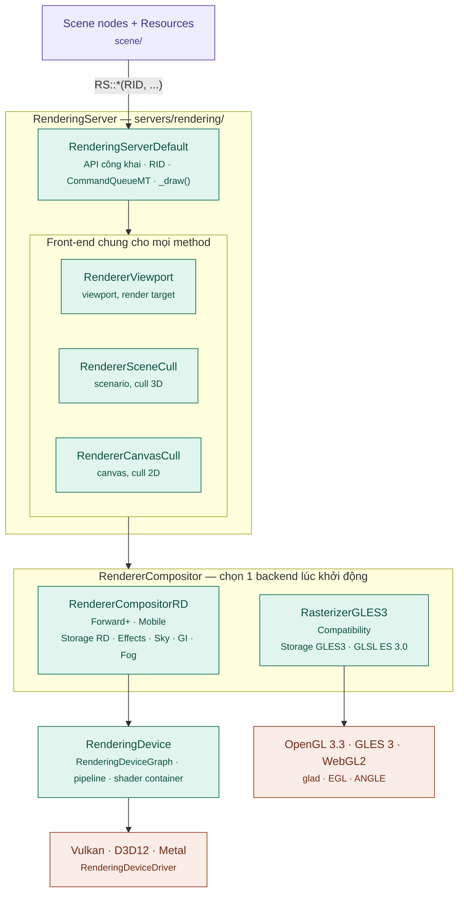
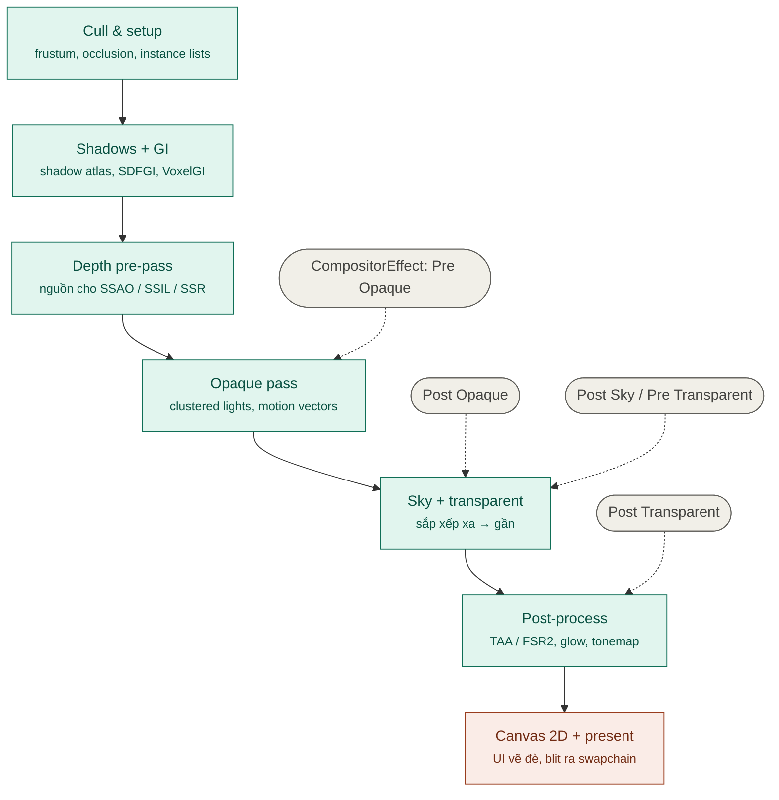
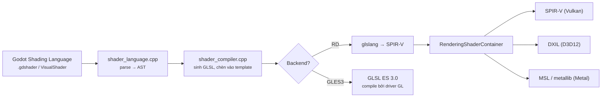

# Kiến trúc hệ thống Render (Godot → Bamboo Engine)

> Phân tích dựa trên source code thực trong repo `bamboo` (Godot 4.8-dev), thư mục chính `servers/rendering/` và `drivers/`.
> Tài liệu liên quan: [architecture.md](architecture.md) (kiến trúc tổng thể), [ENGINE_ANALYSIS.md](ENGINE_ANALYSIS.md) (tech stack, thirdparty, roadmap).

---

## 1. Mô hình tổng quát

Godot dùng mô hình **retained-mode renderer** chia 4 tầng. Scene không "tự vẽ" mỗi frame — nó **mô tả thế giới** cho server ("có mesh này, ở transform này, dùng material này"), server tự quyết định vẽ gì và vẽ thế nào.

| Tầng | Câu hỏi nó trả lời | Thành phần chính (`servers/rendering/`) |
| :--- | :--- | :--- |
| 1. Front-end API | "Thế giới gồm những gì?" | `RenderingServer` / `RenderingServerDefault` — API công khai, RID |
| 2. Scene management & culling | "Frame này cái gì nhìn thấy được?" | `RendererViewport`, `RendererSceneCull`, `RendererCanvasCull` |
| 3. Rendering backend | "Vẽ chúng bằng kỹ thuật gì?" | `RendererCompositor` → storage, scene render, canvas render, effects |
| 4. Graphics abstraction | "Gửi lệnh GPU bằng API nào?" | `RenderingDevice` → `RenderingDeviceDriver` (hoặc GL trực tiếp) |

Tầng 1–2 **dùng chung cho mọi renderer**; từ tầng 3 trở xuống mới rẽ nhánh. Đây là ranh giới cho phép Godot có 3 rendering method mà Scene không cần biết.

### 1.1 Sơ đồ kiến trúc



### 1.2 Cách các tầng gắn với nhau — `RSG` (RenderingServerGlobals)

`RenderingServerDefault` không gọi trực tiếp backend; nó đi qua namespace toàn cục `RSG` (`servers/rendering/rendering_server_globals.h`). Khi khởi động (`rendering_server_default.cpp:249-259`):

```cpp
RSG::rasterizer        = RendererCompositor::create();   // RD hoặc GLES3
RSG::utilities         = RSG::rasterizer->get_utilities();
RSG::texture_storage   = RSG::rasterizer->get_texture_storage();
RSG::material_storage  = RSG::rasterizer->get_material_storage();
RSG::mesh_storage      = RSG::rasterizer->get_mesh_storage();
RSG::light_storage     = RSG::rasterizer->get_light_storage();
RSG::particles_storage = RSG::rasterizer->get_particles_storage();
RSG::gi / RSG::fog / RSG::canvas_render / scene_render ...
```

Interface `RendererCompositor` (`servers/rendering/renderer_compositor.h:65-75`) bắt buộc backend cung cấp: `get_canvas()`, `get_scene()`, `get_fog()`, `get_gi()`, `get_light_storage()`, `get_material_storage()`, `get_mesh_storage()`, `get_particles_storage()`, `get_texture_storage()`, `get_utilities()`.

Mỗi storage là interface trừu tượng trong `servers/rendering/storage/`, được implement riêng bởi:
- `servers/rendering/renderer_rd/storage_rd/` — backend RD
- `drivers/gles3/storage/` — backend GLES3
- `servers/rendering/dummy/` — headless / server build

**Phân công trách nhiệm:**
- **Tài nguyên** (mesh, texture, material, light, particles) → do **storage của backend** quản lý. Ví dụ `RS::mesh_create()` → `RSG::mesh_storage->mesh_allocate()`.
- **Đối tượng trong thế giới** (instance, camera, scenario, canvas item) → do **tầng culling chung** quản lý. Ví dụ `RS::instance_create()` → `RendererSceneCull`.

### 1.3 Ba rendering method

| | Forward+ | Mobile | Compatibility |
| :--- | :--- | :--- | :--- |
| Thư mục | `renderer_rd/forward_clustered/` | `renderer_rd/forward_mobile/` | `drivers/gles3/` |
| GPU API | Vulkan / D3D12 / Metal | Vulkan / D3D12 / Metal | OpenGL 3.3 / GLES 3 / WebGL2 |
| Chiếu sáng | Clustered (`cluster_builder_rd`), số đèn gần như không giới hạn | Forward per-object, giới hạn đèn/object | Forward per-object, ít đèn |
| GI | SDFGI, VoxelGI, LightmapGI, SSIL | LightmapGI, VoxelGI (hạn chế) | LightmapGI |
| Hiệu ứng | SSAO, SSR, SSIL, volumetric fog, TAA, FSR2, SMAA | Ít pass; gộp opaque + transparent + tonemap trong 1 subpass | Glow, tonemap cơ bản |
| Mục tiêu | Desktop high-end | Mobile / VR / tile-based GPU | Web, máy yếu, GPU cũ |

Chọn method: project setting `rendering/renderer/rendering_method`. Chọn driver: `rendering/rendering_device/driver` hoặc `rendering/gl_compatibility/driver` (định nghĩa trong `main/main.cpp`).

---

## 2. Vòng đời một frame

### 2.1 `RenderingServerDefault::_draw()` (`rendering_server_default.cpp:76`)

```mermaid
flowchart LR
    A["begin_frame()"] --> B["scene->update()<br/><small>instance, AABB</small>"]
    B --> C["canvas->update()"]
    C --> D["update_particles()"]
    D --> E["render_probes()<br/><small>reflection, VoxelGI</small>"]
    E --> F["viewport->draw_viewports()"]
    F --> G["canvas_render->update()"]
    G --> H["end_frame()<br/><small>present</small>"]
    H --> I["visibility notifiers<br/>profiler timestamps"]
```



Trong `draw_viewports()`, với mỗi viewport có camera 3D, `RendererSceneCull::render_camera()` thực hiện cull rồi gọi scene render của method đang dùng.

### 2.2 Chuỗi pass của Forward+

Lấy theo các `RENDER_TIMESTAMP` trong `servers/rendering/renderer_rd/forward_clustered/render_forward_clustered.cpp`:



Chi tiết:
- **Shadows + GI**: directional/spot shadow có thể render **song song** với GI (`"Render GI + Render Directional/SpotLight Shadows (Parallel)"`); omni light có cube shadow riêng.
- **Sau depth pre-pass**: các hiệu ứng screen-space (SSAO, SSIL, SSR, SSCS — `effects/ss_effects.cpp`) được tính trước opaque.
- **Compositor effects**: 5 điểm hook — Pre Opaque, Post Opaque, Post Sky, Pre Transparent, Post Transparent — cho phép chèn pass tùy biến qua `CompositorEffect` (`scene/resources/compositor.h`) bằng script/GDExtension mà không sửa engine.
- **Post-process**: FSR2/TAA upscale + anti-alias, `effects/tone_mapper.cpp` làm glow, tonemap, color correction.
- **Mobile** (`render_forward_mobile.cpp`) gộp thành ít render pass hơn ("Render Opaque + Transparent + Tonemap" trong một pass có subpass) để giữ dữ liệu trong tile memory của GPU di động.

---

## 3. Các phân hệ chính

### 3.1 Hệ thống 2D (Canvas)

- `RendererCanvasCull` giữ cây canvas item (transform, z-index, clip, light 2D, occluder) và tạo danh sách item đã sắp xếp mỗi frame.
- `RendererCanvasRender` (RD: `renderer_rd/renderer_canvas_render_rd.cpp`) **batch** các item cùng texture/material để giảm draw call.
- Light/shadow 2D tính trên GPU bằng SDF.
- 2D không đi qua pipeline 3D, nhưng vẽ chung vào viewport.

### 3.2 Hệ thống Shader



- 6 loại shader (`ShaderMode` trong `rendering_server_enums.h`): `spatial`, `canvas_item`, `particles`, `sky`, `fog`, `texture_blit`.
- Template shader engine: `renderer_rd/shaders/*.glsl`, `drivers/gles3/shaders/*.glsl`.
- Pipeline được cache (`pipeline_cache_rd`, `pipeline_hash_map_rd`); ubershader + biến thể compile nền để tránh stutter.
- **Shader baker** khi export (`editor/shader/shader_baker/` — plugin cho Vulkan, D3D12, Metal) cho phép pre-compile shader vào bản build.

### 3.3 RenderingDevice — lớp trừu tượng GPU

- API kiểu Vulkan nhưng đơn giản hóa: buffer, texture, sampler, uniform set, render/compute pipeline, draw list, compute list (`servers/rendering/rendering_device.h`).
- **`RenderingDeviceGraph`** (`rendering_device_graph.h`) ghi lại lệnh của frame, tự suy ra barrier/layout transition và sắp xếp lại để gộp pass → renderer phía trên không phải tự đồng bộ.
- Mỗi API thật chỉ cần implement:
  - `RenderingDeviceDriver` (`rendering_device_driver.h`) — interface mức thấp.
  - `RenderingContextDriver` (`rendering_context_driver.h`) — surface/swapchain.
- Implementation hiện có: `drivers/vulkan/`, `drivers/d3d12/`, `drivers/metal/`.

### 3.4 Storage — quản lý tài nguyên GPU

| Storage | Quản lý | File RD |
| :--- | :--- | :--- |
| `TextureStorage` | Texture 2D/3D/layered, render target, decal atlas | `storage_rd/texture_storage.cpp` |
| `MaterialStorage` | Shader, material, global shader uniform | `storage_rd/material_storage.cpp` |
| `MeshStorage` | Mesh, surface, skeleton, blend shape, multimesh | `storage_rd/mesh_storage.cpp` |
| `LightStorage` | Light, shadow atlas, reflection probe, lightmap | `storage_rd/light_storage.cpp` |
| `ParticlesStorage` | GPU particles, collider | `storage_rd/particles_storage.cpp` |
| `RenderSceneBuffers` | Buffer theo viewport (color, depth, velocity, các mức upscale) | `storage_rd/render_scene_buffers_rd.cpp` |
| `Utilities` | Visibility notifier, timestamp/profiler, memory info | `storage_rd/utilities.cpp` |

Environment (`renderer_rd/environment/`): `sky.cpp`, `gi.cpp` (SDFGI/VoxelGI), `fog.cpp` (volumetric fog).
Effects (`renderer_rd/effects/`): `ss_effects`, `taa`, `fsr`, `fsr2`, `metal_fx`, `smaa`, `bokeh_dof`, `tone_mapper`, `luminance`, `vrs`, `copy_effects`, `motion_vectors_store`, …

### 3.5 Mô hình luồng

- `rendering/driver/threads/thread_model`:
  - `Safe` (mặc định): lệnh `RS::*` chạy trên main thread.
  - `Separate`: lệnh đi qua `CommandQueueMT` sang render thread riêng (`servers/server_wrap_mt_common.h`).
- RID được cấp trước bằng `*_allocate()` → main thread nhận handle ngay, không chờ render thread.
- Trong frame: compile shader, cull (`WorkerThreadPool`), một phần GI/shadow chạy song song.

---

## 4. Điểm mở rộng & đề xuất cải tiến cho Bamboo

### 4.1 Các điểm mở rộng có sẵn (từ dễ đến khó)

| Mức | Cách làm | Vị trí | Cần build lại engine? | Rủi ro khi rebase upstream |
| :--- | :--- | :--- | :--- | :--- |
| 1 | `CompositorEffect` — chèn pass tại 5 hook | `scene/resources/compositor.h` (dùng từ script/GDExtension) | Không | Rất thấp |
| 2 | Thêm/sửa effect, upscaler mới qua interface `SpatialUpscaler` (`ensure_context`, `process`) | `renderer_rd/effects/`, `spatial_upscaler.h` | Có | Thấp |
| 3 | Rendering method mới (vd. deferred) — kế thừa `RendererSceneRenderRD`, tái dùng storage/effects/driver | thư mục mới cạnh `forward_clustered/` | Có | Trung bình |
| 4 | Backend GPU mới (console, WebGPU) — implement `RenderingDeviceDriver` + `RenderingContextDriver` | `drivers/<api>/` | Có | Thấp (interface ổn định) |
| 5 | Thay cả backend không dùng RD — implement `RendererCompositor` + toàn bộ storage | như `drivers/gles3/` | Có | Cao, khối lượng lớn |

### 4.2 Đề xuất cải tiến cho Bamboo

Các đề xuất dưới đây là **định hướng kỹ thuật**, chưa phải tính năng có sẵn. Sắp theo tỉ lệ lợi ích / chi phí.

#### A. Ngắn hạn — cấu hình & pipeline sản phẩm (không sửa lõi)

1. **Chốt 1 rendering method cho mỗi sản phẩm** và strip phần còn lại để giảm binary và bề mặt bug:
   - Game mobile: `forward_plus_renderer=no`, giữ Mobile; cân nhắc `opengl3=no` nếu không cần fallback.
   - Game web: `vulkan=no`, chỉ Compatibility.
   - Game PC: `forward_mobile_renderer=no`.
2. **Bật Shader baker khi export** (`editor/shader/shader_baker/`) để pre-compile shader cho Vulkan/D3D12/Metal → giảm stutter lần đầu chơi. Kết hợp với "warm-up scene" load toàn bộ material chính trong màn loading.
3. **Bộ `CompositorEffect` nội bộ** (outline, stylized post-process, fog of war, custom AO…) đóng gói thành **GDExtension/addon "bamboo_render_fx"** — không đụng engine, dùng lại giữa các game.
4. **Chuẩn hóa profiling**: tận dụng `RENDER_TIMESTAMP` + `RSG::utilities` timestamp; bật profiler (SCons `profiler=tracy|perfetto|instruments` + `profiler_path=…`) cho build nội bộ; đặt **ngân sách GPU theo pass** (shadow, opaque, post) cho từng nền tảng mục tiêu.

#### B. Trung hạn — mở rộng trong `renderer_rd` (module/patch nhỏ, dễ rebase)

5. **Texture streaming**: repo đã có `modules/texture_streaming/` (singleton `TextureStreaming`, feedback thread + I/O thread riêng). Đánh giá, bật và tinh chỉnh cho game có thế giới lớn để giảm VRAM.
6. **Upscaler riêng / vendor**: implement `SpatialUpscaler` cho DLSS/XeSS/FSR3 (hoặc upscaler tự viết) — interface chỉ 3 hàm, cô lập tốt.
7. **Visibility & LOD**: tinh chỉnh `RendererSceneCull` (occlusion culling với Embree, `mesh_lod_threshold`, HLOD tự động từ `meshoptimizer`) cho scene đông object; bổ sung **impostor/billboard LOD** cho cây cối, đám đông.
8. **Render path chuyên biệt cho 2D**: nếu Bamboo thiên về game 2D, tối ưu `renderer_canvas_render_rd` (batching theo atlas, giảm state change, instancing sprite) — mang lại hiệu quả lớn hơn tối ưu 3D.
9. **Material/shader library chuẩn Bamboo**: bộ `.gdshaderinc` dùng chung + global shader uniforms (thời tiết, thời gian trong ngày, wind) để các team viết shader nhất quán và hạn chế số biến thể pipeline.

#### C. Dài hạn — thay đổi kiến trúc (cần team rendering riêng)

10. **Rendering method thứ 4 (Deferred / Visibility buffer)** trong thư mục mới cạnh `forward_clustered/`, kế thừa `RendererSceneRenderRD` — phù hợp scene nhiều đèn động. Tái dùng nguyên storage, effects, GI và mọi driver.
11. **GPU-driven rendering**: culling + build draw list bằng compute shader, indirect draw, meshlet (meshoptimizer đã có sẵn trong `thirdparty/`) — giảm tải CPU cho scene hàng trăm nghìn instance. Tác động chủ yếu vào `RendererSceneCull` và `render_forward_*`.
12. **Expose render graph cho gameplay/tech-art**: hiện `RenderingDeviceGraph` là nội bộ; có thể tạo lớp API cấp cao (khai báo pass + resource) để tech-art dựng pipeline tùy biến mạnh hơn `CompositorEffect`.
13. **Backend nền tảng mới**: console (qua hợp tác NDA) hoặc **WebGPU** cho web — implement `RenderingDeviceDriver` + `RenderingContextDriver`; toàn bộ tầng trên giữ nguyên.

### 4.3 Nguyên tắc khi sửa render trong fork Bamboo

- **Ưu tiên theo thứ tự**: CompositorEffect → module/GDExtension → patch `renderer_rd` → sửa `RenderingServer` API. Càng xuống dưới, chi phí rebase upstream càng cao.
- **Không đổi interface `RenderingServer`** trừ khi bắt buộc — đó là hợp đồng với toàn bộ Scene layer, script và GDExtension.
- **Đánh dấu mọi patch** trong `servers/rendering/` bằng `// BAMBOO:` và gom vào commit riêng theo tính năng.
- **Kiểm thử hình ảnh tự động**: dựng bộ scene chuẩn + so sánh screenshot (golden image) chạy trên CI cho từng driver (Vulkan/D3D12/Metal/GLES3) để phát hiện hồi quy sau mỗi lần rebase.
- **Giữ 3 backend đồng bộ tính năng tối thiểu**: tính năng mới ở Forward+ cần có fallback (hoặc tắt có kiểm soát) ở Mobile/Compatibility.
