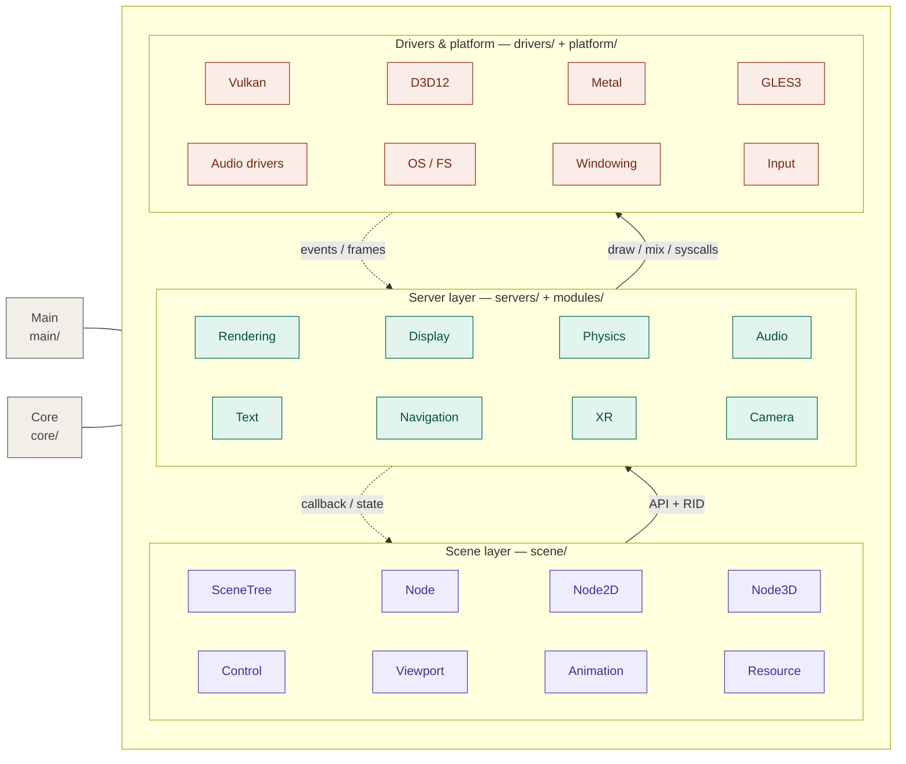
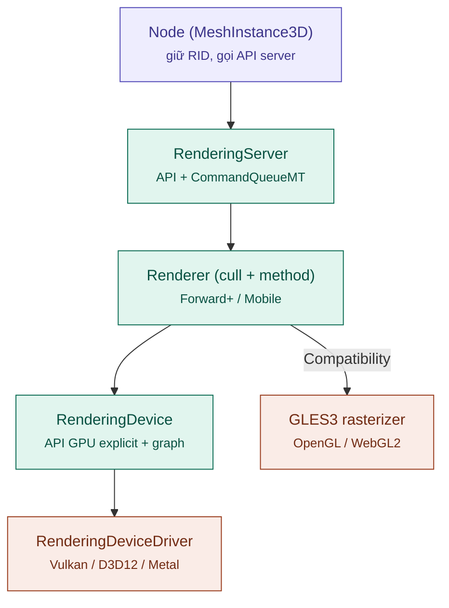
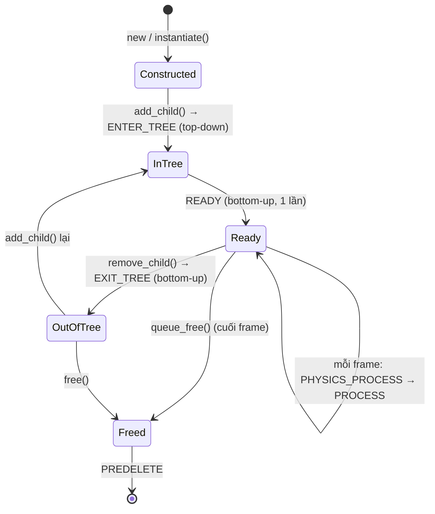
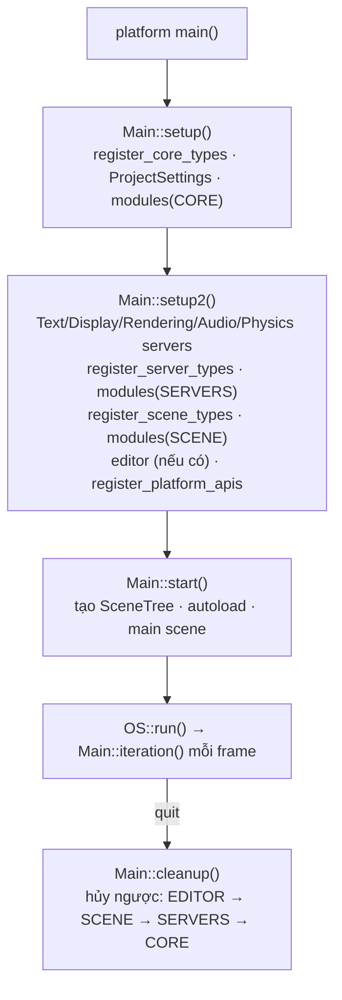

# Kiến trúc Godot Engine (nền tảng của Bamboo Engine)

> Dựa trên tài liệu chính thức [Godot's architecture overview](https://docs.godotengine.org/en/stable/engine_details/architecture/godot_architecture_diagram.html) và đối chiếu với source code thực trong repo `bamboo` (Godot 4.8-dev).

---

## 0. Sơ đồ tổng thể

Bố cục giữ đúng theo tài liệu chính thức: ba tầng xếp chồng, **Main** và **Core** là hai cột dọc tương tác với cả ba tầng. Mũi tên liền = lệnh đi xuống (gọi API); mũi tên đứt = dữ liệu/sự kiện đi lên (input, kết quả va chạm, callback).

## 1. Nguyên tắc chung giữa các tầng

- **Phụ thuộc một chiều xuống dưới**: Scene → Server → Driver. Không include ngược (`servers/` không bao giờ `#include "scene/..."`). Nhờ vậy engine có thể chạy không có scene (server headless) hoặc thay cả tầng scene.
- **Core và Main là "xương sống", không phải một tầng**: mọi tầng đều dùng Core (`Object`, `Variant`, `String`, `Vector`, `Thread`); Main điều phối thời điểm tạo/chạy/hủy cả ba tầng.
- **Giao tiếp qua handle, không qua con trỏ**: Scene giữ `RID` (opaque ID), dữ liệu thật nằm trong server. Đây là điểm khác biệt lớn nhất của Godot so với engine ECS hay OOP thuần.

---

## 2. Core — `core/`

| Component | Vai trò | Quan hệ với tầng khác |
| :--- | :--- | :--- |
| `Object` + `GDCLASS` | Gốc của mọi thứ: signal, notification, property, script instance | Node, Resource, mọi Server đều là `Object` |
| `ClassDB` | Registry reflection (method/property/signal/enum) | "Hợp đồng" để GDScript, C#, GDExtension, Inspector nhìn thấy class C++ |
| `Variant` | Kiểu động (~40 kiểu), tham số của mọi lời gọi động | Mọi call qua script, signal, `call_deferred`, serialize |
| `RefCounted` / `Ref<T>` | Đếm tham chiếu | `Resource` tự giải phóng; `Node` thì không (do cây sở hữu) |
| `StringName` | Chuỗi intern, so sánh bằng con trỏ | Tên method/property/signal/input action |
| `MessageQueue` | Hàng đợi `call_deferred` | Main flush nhiều lần mỗi frame |
| `WorkerThreadPool`, `CommandQueueMT` | Job system và hàng lệnh đa luồng | Server chạy thread riêng, ResourceLoader load async |
| `ResourceLoader/Saver`, `FileAccess`, `PackedData` | I/O, VFS `res://` / `user://`, `.pck` | Scene load `.tscn/.tres` qua đây |
| `OS` (abstract) | Thời gian, thread, process, đường dẫn | Mỗi platform implement `OS_*` |
| `GDExtension` | Nạp thư viện động qua C ABI | Extension đăng ký class vào `ClassDB` như module C++ |

---

## 3. Server layer — `servers/` (+ implementation trong `modules/`)

Mọi server theo cùng một pattern:

1. **Singleton + interface ảo** — `RenderingServer::get_singleton()->mesh_create()`.
2. **Tài nguyên = RID** — server lưu dữ liệu trong `RID_Owner<T>` (pool liên tục, cache-friendly, xử lý hàng loạt).
3. **Có thể chạy thread riêng** — `servers/server_wrap_mt_common.h` bọc mỗi API: gọi từ thread khác → đẩy vào `CommandQueueMT`, không chặn caller.
4. **Implementation thay được qua Manager** — `PhysicsServer3DManager`, `TextServerManager`, `NavigationServer3DManager` chọn backend lúc runtime.

| Server | Chức năng | Implementation thực | Nói chuyện với |
| :--- | :--- | :--- | :--- |
| `RenderingServer` | Cull, viewport, canvas 2D, scene 3D, material, light, GI, post-FX | `RenderingServerDefault` → `RendererSceneCull` / `RendererCanvasCull` → `renderer_rd` hoặc `drivers/gles3` | Driver GPU, `DisplayServer` (swapchain/window) |
| `DisplayServer` | Cửa sổ, event input, cursor, IME, clipboard, dialog | Mỗi platform (`DisplayServerWindows`, `…X11`, `…Wayland`, `…MacOS`…) | Đẩy event lên `Input` (core) → `SceneTree` |
| `PhysicsServer2D/3D` | Space, body, shape, joint, query (raycast, overlap) | `modules/godot_physics_2d/3d`, `modules/jolt_physics` | Main gọi `sync()` / `step()`; kết quả về scene qua callback `body_state_changed` |
| `AudioServer` | Bus, effect, mix trên thread audio riêng | `servers/audio` + `AudioDriver` (WASAPI/CoreAudio/Pulse/ALSA…) | Node `AudioStreamPlayer*` đẩy `AudioStreamPlayback` vào |
| `TextServer` | Shaping, BiDi, raster font | `text_server_adv` (HarfBuzz+ICU) / `text_server_fb` | `Font`, `Label`, `RichTextLabel` lấy glyph → `RenderingServer` vẽ |
| `NavigationServer2D/3D` | Navmesh, pathfinding, avoidance | `modules/navigation_2d/3d` (Recast, RVO2) | Chạy trong bước physics, trả avoidance qua callback |
| `XRServer` | Tracker, headset, controller | `modules/openxr`, `webxr`, `mobile_vr` | Cấp pose cho camera; `RenderingServer` render stereo |
| `CameraServer` | Nguồn webcam / camera thiết bị | `servers/camera` + driver platform | Trả frame dạng texture |

### 3.1 Đường đi của một lệnh render (Scene → GPU)

- **Node → RenderingServer**: `MeshInstance3D` khi `set_mesh()` / đổi transform gọi `RS::instance_set_base(rid, mesh_rid)`. Nếu `rendering/driver/threads/thread_model = Separate`, lệnh vào `CommandQueueMT` và trả về ngay — RID đã được cấp trước (`*_allocate()`), main thread không phải chờ.
- **Renderer**: `RendererSceneCull` giữ scenario, cull frustum/occlusion (Embree), rồi gọi `RendererSceneRender`. Hai method: Forward+ (`forward_clustered`, clustered lighting cho desktop) và Mobile (`forward_mobile`, ít pass, tối ưu tile-based GPU).
- **RenderingDevice** (`servers/rendering/rendering_device.h`): API GPU explicit do Godot tự định nghĩa (draw list, compute list, uniform set, pipeline). `RenderingDeviceGraph` tự sắp xếp barrier và gộp pass.
- **RenderingDeviceDriver**: lớp mỏng dịch sang Vulkan / D3D12 / Metal. Port console hay WebGPU = viết thêm một driver ở đây.
- **Nhánh GLES3 "Compatibility"** bỏ qua RenderingDevice, implement trực tiếp `RendererCompositor` trong `drivers/gles3`.

---

## 4. Scene layer — `scene/`

| Component | Vai trò | Dùng server nào |
| :--- | :--- | :--- |
| `SceneTree` | `MainLoop` mặc định; giữ root `Window`, group, process list, timer, tween, multiplayer | Main gọi `physics_process()` / `process()` mỗi frame |
| `Node` | Đơn vị cơ bản: cây cha–con, notification, process callback | — (logic thuần) |
| `CanvasItem` → `Node2D` / `Control` | 2D & UI; mỗi item có một canvas item RID | `RenderingServer` (canvas), `TextServer` (Control) |
| `Node3D` → `VisualInstance3D`, `CollisionObject3D` | 3D: transform, instance render, body vật lý | `RenderingServer` (instance), `PhysicsServer3D` (body) |
| `Viewport` / `Window` | Render target + nơi phân phối input xuống node | `RenderingServer` (viewport), `DisplayServer` (window) |
| `AnimationPlayer` / `AnimationTree` / `Tween` | Nội suy property qua `Variant` + `ClassDB` | — |
| `Resource` (`Mesh`, `Texture`, `Material`, `PackedScene`…) | Dữ liệu dùng chung, ref-counted, serialize được | Mỗi resource hình ảnh giữ RID trong `RenderingServer` |

**Vòng đời Node**:

---

## 5. Drivers & platform interface — `drivers/`, `platform/`

- **`drivers/`** — code driver tái sử dụng được giữa nhiều nền tảng:
  - GPU: `vulkan`, `d3d12`, `metal`, `gles3`
  - Audio: `wasapi`, `coreaudio`, `pulseaudio`, `alsa`, `xaudio2`
  - MIDI, `sdl` (gamepad), `accesskit`
  - `unix` / `windows`: `FileAccess`, `DirAccess`, `Thread`
- **`platform/<name>/`** — phần đặc thù từng nền tảng: `OS_*`, `DisplayServer*`, entry `main()` thật (vd. `platform/linuxbsd/godot_linuxbsd.cpp:70`), export plugin cho editor, `detect.py` cho SCons.
- **Chiều đi lên**: `DisplayServer` gom event OS → `InputEvent` → `Input` (core) → `Viewport::push_input()` → `_input` / `_gui_input` / `_unhandled_input` của Node.

---

## 6. Main — `main/main.cpp`

### 6.1 Khởi động và tắt

Mỗi bước `initialize_modules(level)` đi kèm khởi tạo GDExtension cùng level.

### 6.2 Một frame — `Main::iteration()` (`main/main.cpp:4917`)

| Bước | Việc xảy ra | Tầng |
| :--- | :--- | :--- |
| 1 | `MainTimerSync` tính số bước physics cần chạy | Main |
| 2 | `PhysicsServer::sync()` + `flush_queries()` — đẩy trạng thái body lên scene | Server → Scene |
| 3 | `SceneTree::physics_process()` — `_physics_process` của node | Scene |
| 4 | `NavigationServer::physics_process()` | Server |
| 5 | `MessageQueue::flush()` — chạy các `call_deferred` | Core |
| 6 | `PhysicsServer::step()` — mô phỏng | Server |
| 7 | `SceneTree::process()` — `_process`, tween, timer | Scene |
| 8 | `RenderingServer::sync()` / `draw()` | Server → Driver |
| 9 | `ScriptServer::frame()`, `GDExtensionManager::frame()`, debugger | Core |

Bước 2–6 lặp 0..N lần mỗi frame (fixed timestep); bước 7–8 chạy đúng 1 lần.

---

## 7. Các kênh giao tiếp giữa component

| Kênh | Chiều | Cơ chế | Ví dụ |
| :--- | :--- | :--- | :--- |
| API server + RID | Scene → Server | Gọi hàm ảo trên singleton, có thể vào command queue | `RS::instance_set_transform` |
| Callback / Callable | Server → Scene | `Callable` đăng ký trước, gọi trong `sync()` | Physics `body_state_changed`, avoidance callback |
| Input event | Platform → Scene | `DisplayServer` → `Input` → `Viewport` | Phím, chạm, gamepad |
| Notification | Main/Tree → Node | `_notification(int)` | `READY`, `PROCESS`, `EXIT_TREE` |
| Signal | Object ↔ Object | Qua `ClassDB` / `Variant` | `pressed`, `body_entered` |
| Deferred call | Mọi nơi → cuối bước | `MessageQueue` | `call_deferred`, `queue_free` |
| Reflection | Script/Extension ↔ C++ | `ClassDB` + `Variant` + `MethodBind` | GDScript gọi `Node.add_child` |

---

## 8. Hệ quả cho Bamboo Engine

- Thay renderer hoặc physics chỉ cần làm việc ở **ranh giới Server ↔ Driver** hoặc cắm implementation mới sau interface Server — Scene layer và code game gần như không phải sửa.
- `Object` / `Variant` / `ClassDB` trong Core ảnh hưởng mọi tầng và mọi script — là phần **nên giữ ổn định nhất**.

Xem thêm: [ENGINE_ANALYSIS.md](ENGINE_ANALYSIS.md) (tech stack, audit thirdparty, roadmap tùy biến).
